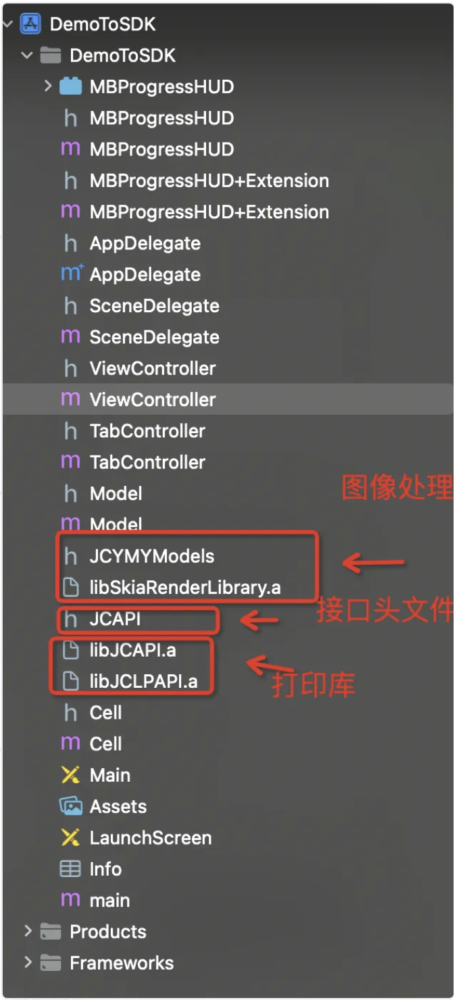
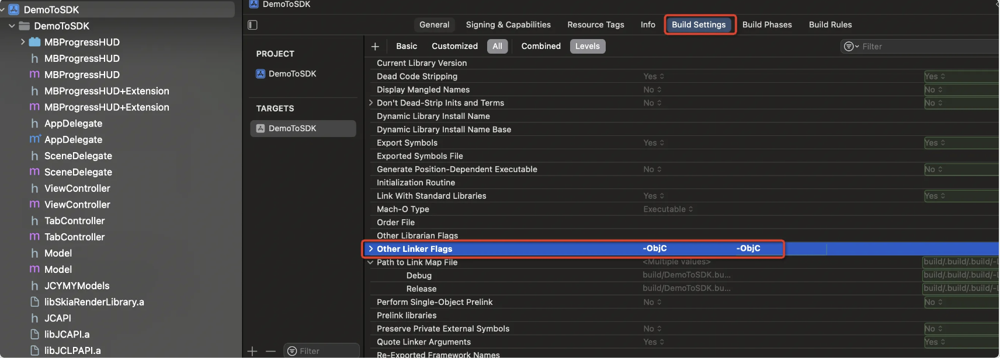
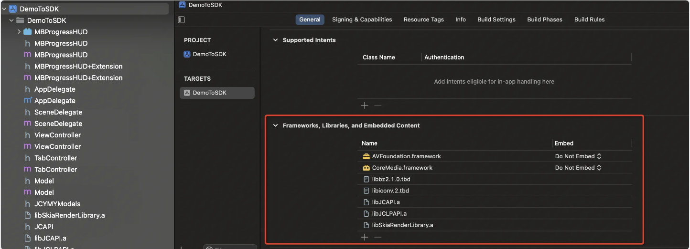
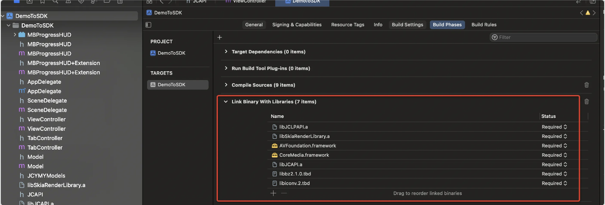

# iOS SDK API Documentation V3.2.8 (English Translation)

---

## Title Page
*iOS SDK API Documentation V3.2.8*

---

## Table of Contents

- Document Revision History
- Product Purpose
- Product Features
  - 1. Engineering Configuration
    - 1.1 Import Dependencies
    - 1.2 Project Configuration
      - 1.2.1 OC Reflection Configuration
      - 1.2.2 Dependency Configuration
      - 1.2.3 Permission Declaration
  - 2. Interface Usage Process Example Code
    - 2.1 Search for Printer
      - 2.1.1 Search for Bluetooth Printer
      - 2.1.2 Search for WiFi Printer
    - 2.2 Connect to Printer
      - 2.2.1 Connect to Bluetooth Printer
      - 2.2.2 Connect to WiFi Printer
    - 2.3 Printer Usage Related Methods
  - 3. Printer Connection Related Methods
    - 3.1 Search for Bluetooth Printer
    - 3.2 Connect to Bluetooth Printer
    - 3.3 Search for WiFi Printer
    - 3.4 Search for WiFi Printer (with Timeout Settings)
    - 3.5 Get WiFi Name of Currently Connected Phone
    - 3.6 Configure Printer to Connect to Phone's Current WiFi
    - 3.7 Get Printer Wi-Fi Configuration Information
    - 3.8 Connect to WiFi Printer
    - 3.9 Connect to WiFi Printer (Specific Port)
    - 3.10 Close Printer
    - 3.11 Get Currently Connected Printer Name
    - 3.12 Get Current Connection Status
  - 4. Printer Parameter Settings and Retrieval Methods
    - 4.1 Printer Error Reporting
    - 4.2 Get Printer Page Count
    - 4.3 Monitor Printer Status Changes
    - 4.4 Get Label Size Installed in Printer
  - 5. Barcode Types and Return Information Description
    - 5.1 Barcode Types
  - 6. Drawing/Printing Interfaces
    - 6.1 Initialize Image Library
    - 6.2 Start Drawing
    - 6.3 Draw Text
    - 6.4 Draw 1D Barcode
    - 6.5 Draw 2D Barcode
    - 6.6 Draw Line
    - 6.7 Draw Shape
    - 6.8 Draw Image
    - 6.9 Generate JSON String for Label Data
    - 6.10 Get Preview of Content Drawn on Canvas
    - 6.11 Set SDK Print Cache
    - 6.12 Set Total Number of Prints
    - 6.13 Utility Methods
      - 6.13.1 Millimeter to Pixel Conversion
      - 6.13.2 Pixel to Millimeter Conversion
      - 6.13.3 Get Display Multiple
      - 6.13.4 Millimeter to Inch Conversion
      - 6.13.5 Inch to Millimeter Conversion
      - 6.13.6 Check RFID Support
    - 6.14 Start Print Job
    - 6.15 Print Bitmap Data
    - 6.16 Submit Print Job
    - 6.17 Submit Print Job with RFID Support
    - 6.18 End Print Job
    - 6.19 Cancel Printing
  - 7. Example Application
  - 8. Additional Resources
    - 8.1 Tips for Common Issues
    - 8.2 Known Limitations
  - 9. Model Classes
    - 9.1 JCSModelBase
    - 9.2 JCSColorSupport
    - 9.3 JCSQualitySupport
    - 9.4 JCHalfCutLevel
    - 9.5 OutNetBean
  - 10. Enums and Constants
    - 10.1 JCBarcodeMode
    - 10.2 JCSDKCacheStatus
    - 10.3 JCSDKCammodFontType
    - 10.4 JCSDKCammodRotation
    - 10.5 JCSDKCammodGraphicsType
    - 10.6 Callback Block Types

---

## Revision History

| No. | Version | Description of Changes | Author(s) | Date |
|-----|---------|------------------------|-----------|------|
| 01  | v1.0.1  | Document creation | Wang Yadong | 2019-03-09 |
| 02  | v2.0.0  | 1. Added D11 series printer support<br>2. Added B21 series printer support<br>3. Added B3S series printer support<br>4. Added P1 series printer support | Yu Mingyi / Zhang Bin | 2020-02-04 |
| 03  | v2.0.1  | Firmware upgrade optimization, barcode optimization | Yu Mingyi | 2020-03-30 |
| 04  | V2.1.1  | B21 Wi-Fi function, P1 printer | Yu Mingyi | 2020-04-21 |
| 05  | v2.1.2  | 1. P1: Added total sheet count instruction<br>2. P1: Added blank page printing<br>3. P1: Added callback for ribbon usage after printing is complete | Yu Mingyi | 2020-05-08 |
| 06  | v2.1.3  | 1. Adapted for B16<br>2. Unified error codes<br>3. P1 panel upgrade and detail optimization | Yu Mingyi | 2020-07-07 |
| 07  | v3.0.0  | 1. Added B50 series printer support<br>2. Added B3 series printer support<br>3. Image phase two access | Yu Mingyi | 2020-07-20 |
| 08  | v3.0.1  | 1. Added B3S 4.0.1 adaptation<br>2. Added B16 adaptation<br>3. Added adaptation for unsupported instructions<br>4. Second parameter for printing changed | Yu Mingyi | 2020-09-01 |
| 09  | v3.1.0  | 1. Added adaptation for B32 model<br>2. Added logging function<br>3. Added print cache, up to 5 pages of data | Yu Mingyi | 2020-09-14 |
| 10  | v3.1.1  | 1. Adapted for D110<br>2. Added adaptation for 8761 Bluetooth chip, needs to be enabled | Yu Mingyi | 2021-03-25 |
| 11  | V3.1.2  | 1. Removed adaptation for 8761 Bluetooth interface, defaults to compatibility with all Bluetooth access methods<br>2. Added third-party calling image library drawing function interface | Yu Mingyi | 2021-03-25 |
| 12  | v3.1.3  | 1. Adapted for S6 model<br>2. Adapted 300dpi precision to 11.81<br>3. Synchronized downwards with new features from 3.1.2_beta6<br>4. Adapted new protocol, optimized print timeout issue<br>5. For new protocol models printing in background, time interval changed to 1ms<br>6. Adapted for Z401/Z401R<br>7. D101 cutting changed to center cutting<br>8. Rolled back image library to 2.0.10_beta4 | Yu Mingyi | 2021-08-23 |
| 13  | v3.1.4  | 1. Adapted private protocol V3, supports sending data while printing<br>2. Adapted Zhaoxun B3S<br>3. Adapted for B18 | Yu Mingyi | 2021-09-26 |
| 14  | V3.1.5  | 1. Adapted for B203 model<br>2. Added B203 data sending interval control instruction<br>3. Third-party machine adaptation for printing bitmap binarized data | Yu Mingyi | 2021-11-10 |
| 15  | V3.1.6  | 1. Adapted for B3S and B32 new models | Zhang Bin | 2022-07-15 |
| 16  | v3.1.7  | 1. Adapted P1S new protocol printing<br>2. Added adaptation for B32/A63 new protocol models, black mark paper cut 1mm from top and bottom<br>3. Adapted H1S dashed line setting | Yu Mingyi | 2022-08-01 |
| 17  | v3.1.8  | 1. Adapted dual-color printing protocol | Yu Mingyi | 2022-11-01 |
| 18  | v3.1.9  | 1. Adapted for K3, K3_W new models<br>2. Added Wi-Fi related interfaces<br>3. Removed deprecated interfaces | Yu Mingyi | 2023-08-07 |
| 19  | v3.2.0  | 1. Removed deprecated interfaces | Yu Mingyi | 2023-10-24 |
| 20  | v3.2.0  | 1. Added interface to set SDK cache to solve abnormal callback issue after submitting tasks during batch printing | Zhang Bin | 2024-01-03 |
| 21  | v3.2.4  | New Features:<br>1. Support M2 model<br>2. Support B21_H model<br>3. Support B3S_P, A8_P, S6_P models<br>4. Support B31 model<br>5. Replaced with new image library<br>   b. Improved functionalities of old image library that were not effective<br>   c. Fixed some bugs in old image library<br>6. Support for some models to get the label size installed inside the printer (M2) | Yu Mingyi | 2024-07-19 |
| 22  | v3.2.8  | New Features:<br>1. Support B21 Pro model<br>2. Support K2 model<br>Bug Fixes:<br>1. Text wrapping mode 6 inconsistent with other ends | Yu Mingyi | 2024-03-15 |

---

## Product Purpose

The JCAPI interface method documentation is designed to explain the interface methods for standard label drawing output, allowing developers to use these interfaces during secondary development to shorten development time and accelerate development speed.

## Product Features

The JCAPI interface provides users with an easy method to create standard label drawing operations. This interface offers methods for creating text, 1D barcodes, 2D barcodes, images, and various shapes, while also supporting rotation of drawings. Users can also use methods to get a preview of the label image created by drawing to assist in making label operations more convenient.

## 1. Engineering Configuration

### 1.1 Import Dependencies

Project structure of the DemoToSDK example:

```
DemoToSDK
└── DemoToSDK
    ├── MBProgressHUD
    │   ├── MBProgressHUD.h
    │   ├── MBProgressHUD.m
    │   ├── MBProgressHUD+Extension.h
    │   └── MBProgressHUD+Extension.m
    ├── AppDelegate.h
    ├── AppDelegate.m
    ├── SceneDelegate.h
    ├── SceneDelegate.m
    ├── ViewController.h
    ├── ViewController.m
    ├── TabController.h
    ├── TabController.m
    ├── Model
    │   ├── Model.h
    │   └── Model.m
    ├── JCYMYModels            ◀─── Image processing
    ├── libSkiaRenderLibrary.a
    ├── JCAPI                  ◀─── Interface header file
    ├── libJCAPI.a
    ├── libJCLPAPI.a           ◀─── Printing library
    ├── Cell
    │   ├── Cell.h
    │   └── Cell.m
    ├── Main
    ├── Assets
    ├── LaunchScreen
    ├── Info
    └── main.m
    ├── Products
    └── Frameworks
```



### 1.2 Project Configuration

#### 1.2.1 OC Reflection Configuration

In Xcode, navigate to the project's Build Settings:

```
Project Navigator > DemoToSDK > Build Settings tab > All/Levels view
```

Under the "Linking" section, find "Other Linker Flags" and add:

```
-ObjC
```

This flag is required for the SDK to properly load Objective-C categories and classes through reflection.



#### 1.2.2 Dependency Configuration

Two main configuration areas need to be set up in Xcode:

1. **Frameworks, Libraries, and Embedded Content**
   
   Navigate to:
   ```
   Project Navigator > DemoToSDK > General tab > Frameworks, Libraries, and Embedded Content section
   ```
   
   Add the following frameworks and libraries:

   - AVFoundation.framework (Do Not Embed)
   - CoreMedia.framework (Do Not Embed)
   - libbz2.1.0.tbd
   - libiconv.2.tbd
   - libJCAPI.a
   - libJCLPAPI.a
   - libSkiaRenderLibrary.a

   

2. **Link Binary With Libraries**
   
   Navigate to:
   ```
   Project Navigator > DemoToSDK > Build Phases tab > Link Binary With Libraries section
   ```
   
   Ensure all the following libraries are listed as "Required":
   ```
   - libJCLPAPI.a
   - libSkiaRenderLibrary.a
   - AVFoundation.framework
   - CoreMedia.framework
   - libJCAPI.a
   - libbz2.1.0.tbd
   - libiconv.2.tbd
   ```

   

These configurations ensure that the SDK libraries and their dependencies are properly linked to your project.

#### 1.2.3 Permission Declaration

You need to declare Bluetooth permissions in the project's info.plist file, for example:

```
Privacy - Bluetooth Always Usage Description   String   This application requires Bluetooth permission when connecting to the printer service, is it used for communication with the printer?
NSBluetoothPeripheralUsageDescription         String   This application requires Bluetooth permission when connecting to the printer service, is it used for communication with the printer?
```

## 2. Interface Usage Process Example Code

### 2.1 Search for Printer

#### 2.1.1 Search for Bluetooth Printer

```objective-c
// Method for scanning Bluetooth printers
[JCAPI scanBluetoothPrinter:^(NSArray *scanedPrinterNames) {
    // Remove existing data
    [weakSelf.datas removeAllObjects];
    
    // Loop through scanned Bluetooth printer names
    for (NSString *name in scanedPrinterNames) {
        // Check name length, skip if not in specified range
        if (name.length < 6 || name.length > 20) {
            continue;
        }
        
        // Create a Model object and set its properties
        Model *m = [[Model alloc] init];
        m.name = name;
        
        // Add Model object to data array
        [weakSelf.datas addObject:m];
    }
}];
```

#### 2.1.2 Search for WiFi Printer

```objective-c
// Method for scanning Wi-Fi printers
[JCAPI scanWifiPrinter:^(NSArray *scanedPrinterNames1) {
    // Hide progress indicator (hud)
    [weakSelf.hud hideAnimated:NO];
    UIStoryboard *main = [UIStoryboard storyboardWithName:@"Main" bundle:nil];
    // Instantiate a "TabController" view controller
    TabController *vc = [main instantiateViewControllerWithIdentifier:@"TabController"];
    // Pass data (weakSelf.datas) to the view controller
    vc.datas = weakSelf.datas;
    // Add this view controller as a child view controller to the current view controller
    [weakSelf addChildViewController:vc];
    // Add the view controller's view to the current view
    [weakSelf.view addSubview:vc.view];
}];
```

### 2.2 Connect to Printer

#### 2.2.1 Connect to Bluetooth Printer

```objective-c
// Connect to a Bluetooth printer with specified name
[JCAPI openPrinter:connectName completion:^(BOOL isSuccess) {
    NSLOG(@"Connection-%@", isSuccess?@"successful":@"failed");
}];
```

#### 2.2.2 Connect to WiFi Printer

```objective-c
// Connect to a WiFi printer with specified IP (replace with your printer's actual IP address)
NSString *printerIP = @"192.168.1.100";
[JCAPI openPrinterHost:printerIP completion:^(BOOL isSuccess) {
    NSLOG(@"Connection-%@", isSuccess?@"successful":@"failed");
}];
```

### 2.3 Printer Usage Related Methods

```objective-c
//Font name
NSString *fontName = @"SourceHanSans-Regular";
//Font extension
NSString *fontExtension = @"ttc";
//Font path
NSString *fontPath = [[NSBundle mainBundle] pathForResource:fontName ofType:fontExtension];
//Initialize image library
[JCAPI initImageProcessing:fontPath error:nil];
//Get printing error information
[JCAPI getPrintingErrorInfo:^(NSString *printInfo) {
    if([printInfo isEqualToString:@"19"]){
        //Paper error, can continue printing without handling
    }
    else{
        weakSelf.msgView.hidden = YES;
        MBProgressHUD *hub = [MBProgressHUD showMessage:printInfo];
        [hub hideAnimated:YES afterDelay:2.f];
    }
}];
//Total print count
int count = 1;
//Get printing progress
[JCAPI getPrintingCountInfo:^(NSDictionary *printDicInfo) {
    NSString *totalCount = [printDicInfo valueForKey:@"totalCount"];
    if(totalCount.intValue == count){
        [JCAPI endPrint:^(BOOL isSuccess) {
            if(isSuccess)
                weakSelf.msgView.hidden = YES;
        }];
    }
}];
//Set SDK cache
[JCAPI setPrintWithCache:YES];
//Set total print quantity
[JCAPI setTotalQuantityOfPrints:count];
//Density
int blackRules = 3;
//Paper type
int paperStyle = 1;
//Start print job
[JCAPI startJob:blackRules withPaperStyle:paperStyle withCompletion:^(BOOL isSuccess) {
    if(isSuccess){
        //Set canvas dimensions
    }
}];
```

## 3. Printer Connection Related Methods

### 3.1 Search for Bluetooth Printer

```objective-c
/**
 * Scan for nearby Bluetooth printers.
 *
 * This method is used to scan for nearby Bluetooth printers and returns a list of discovered printer names via the callback.
 *
 * @param completion Scanning completion callback. After scanning is complete, this callback will be invoked and pass the list of detected Bluetooth printer names.
 *
 * The array 'scanedPrinterNames' contains the names of detected Bluetooth printers. If no printers are detected, the array will be empty.
 */
+ (void)scanBluetoothPrinter:(void(^)(NSArray *scanedPrinterNames))completion;
```

### 3.2 Connect to Bluetooth Printer

```objective-c
/**
 * Connect to a Bluetooth printer with the specified name.
 *
 * This method is used to establish a connection with a Bluetooth printer with the specified name. Connection status changes will be notified via the provided callback.
 *
 * @param printerName The name of the Bluetooth printer to connect to.
 * @param completion Connection status callback. When the connection status changes, this callback will be used to transmit the connection status result.
 *
 * The parameter 'isSuccess' indicates whether the printer connection was successful, YES means connection successful, NO means connection failed.
 */
+ (void)openPrinter:(NSString *)printerName 
         completion:(DidOpened_Printer_Block)completion;
```

### 3.3 Search for WiFi Printer

```objective-c
/**
 * Scan for nearby Wi-Fi printers.
 *
 * This method is used to scan for nearby Wi-Fi printers and returns a list of discovered printer information via the callback.
 *
 * @param completion Scanning completion callback. After scanning is complete, this callback will be invoked and pass the list of detected Wi-Fi printer information.
 *
 * The array 'scanedPrinterNames' contains information about the detected Wi-Fi printers. Each element is a dictionary containing the following fields:
 *   - 'ipAdd': The IP address of the printer.
 *   - 'bleName': The Bluetooth name.
 *   - 'port': The connection port.
 *   - 'availableClient': Available client connection count.
 */
+ (void)scanWifiPrinter:(void(^)(NSArray *scanedPrinterNames))completion;
```

### 3.4 Search for WiFi Printer (with Timeout Settings)

```objective-c
/**
 * Scan for nearby Wi-Fi printers.
 *
 * This method is used to scan for nearby Wi-Fi printers within a specified timeout period and returns a list of discovered printer names via the callback.
 *
 * @param timeout Scanning timeout in seconds. The scanning operation will be performed within this time period.
 * @param completion Scanning completion callback. After scanning is complete, this callback will be invoked and pass the list of detected Wi-Fi printer names.
 *
 * The array 'scanedPrinterNames' contains the names of detected Wi-Fi printers. If no printers are detected, the array will be empty.
 */
+ (void)scanWifiPrinter:(float)timeout withCompletion:(void(^)(NSArray *scanedPrinterNames))completion;
```

### 3.5 Get WiFi Name of Currently Connected Phone

```objective-c
/**
 * Get the WiFi name currently connected to the phone.
 *
 * This method is used to get the name of the WiFi network that the phone is currently connected to.
 *
 * @return Returns the WiFi name currently connected to the phone.
 */
+ (NSString *)connectingWifiName;
```

### 3.6 Configure Printer to Connect to Phone's Current WiFi

```objective-c
/**
 * Configure printer to connect to the phone's current WiFi.
 *
 * @param wifiName WiFi account name (optional)
 * @param password WiFi password
 * @param completion Callback for whether the printer was successfully configured to connect to WiFi.
 */
+ (void)configurationWifi:(NSString *)wifiName
                 password:(NSString *)password
               completion:(PRINT_DIC_INFO)completion;
```

### 3.7 Get Printer Wi-Fi Configuration Information

```objective-c
/**
 * Get printer Wi-Fi configuration information.
 *
 * This method is used to retrieve Wi-Fi configuration information, usually returning the Wi-Fi name.
 *
 * @param completion Wi-Fi name callback.
 */
+ (void)getWifiConfiguration:(PRINT_DIC_INFO)completion;
```

### 3.8 Connect to WiFi Printer

```objective-c
/**
 * Connect to a printer with the specified IP for Wi-Fi connection.
 *
 * This method is used to establish a Wi-Fi connection with a printer at the specified IP address. Connection status changes will be notified via the provided callback.
 *
 * @param host The IP address of the printer, used to specify which printer to connect to.
 * @param completion Connection status callback. When the connection status changes, this callback will be used to transmit the connection status result.
 *
 * The parameter 'isSuccess' indicates whether the printer connection was successful, YES means connection successful, NO means connection failed.
 */
+ (void)openPrinterHost:(NSString *)host
             completion:(DidOpened_Printer_Block)completion;
```

### 3.9 Connect to WiFi Printer (Specific Port)

```objective-c
/**
 * Connect to a printer with the specified IP and port for Wi-Fi connection.
 *
 * This method is used to establish a Wi-Fi connection with a printer at the specified IP address and port. Connection status changes will be notified via the provided callback.
 *
 * @param host The IP address of the printer, used to specify which printer to connect to.
 * @param port The port number to use for the connection (usually 9100 for printer communication).
 * @param completion Connection status callback. When the connection status changes, this callback will be used to transmit the connection status result.
 *
 * The parameter 'isSuccess' indicates whether the printer connection was successful, YES means connection successful, NO means connection failed.
 */
+(void)openPrinterHost:(NSString *)host
                  port:(uint16_t)port
            completion:(DidOpened_Printer_Block)completion;
```

### 3.10 Close Printer

```objective-c
/**
 * Close the currently opened printer connection.
 *
 * This method is used to close the currently established printer connection. After executing this operation, it will trigger the 'completion(NO)' callback of the 'openPrinter:completion:' method.
 *
 * Note: Using this method will interrupt the connection with the printer.
 */
+ (void)closePrinter;
```

### 3.11 Get Currently Connected Printer Name

```objective-c
/**
 * Get the name of the currently connected printer (Bluetooth or Wi-Fi).
 *
 * This method is used to get the name of the printer that is currently connected. For Wi-Fi connections, it returns the IP address of the printer.
 *
 * @return The name of the currently connected printer. If no printer is connected, it returns nil.
 */
+ (NSString *)connectingPrinterName;
```

### 3.12 Get Current Connection Status

```objective-c
/**
 * Get the current Bluetooth/Wi-Fi connection status.
 *
 * This method is used to get the Bluetooth and Wi-Fi connection status of the current device.
 *
 * @return Return value is an integer indicating the connection status. 0 means no connection, 1 means connected to Bluetooth, 2 means connected to Wi-Fi.
 */
+ (int)isConnectingState;
```

## 4. Printer Parameter Settings and Retrieval Methods

### 4.1 Printer Error Reporting

```objective-c
/**
 * Bluetooth/Wi-Fi printer error reception (used after connection is established).
 *
 * @param error Printer errors:
 *   1: Cover is open
 *   2: Out of paper
 *   3: Low battery
 *   4: Battery error
 *   5: Manual stop
 *   6: Data error (Submission of print data failed - B3/Image generation failed/Data transmission error, printer verification failed to pass by printer return)
 *   7: Temperature too high
 *   8: Paper output error
 *   9: Printer is busy (currently running or feeding paper/currently printing or out of paper/printer is upgrading firmware)
 *   10: Print head not detected
 *   11: Ambient temperature too low
 *   12: Print head not locked
 *   13: Carbon ribbon not detected
 *   14: Incompatible carbon ribbon
 *   15: Used carbon ribbon
 *   16: Unsupported paper type
 *   17: Failed to set paper size
 *   18: Failed to set print mode
 *   19: Failed to set print density (allowed printing, only reports errors)
 *   20: RFID write failure
 *   21: Margin setting error (margin must be greater than 0, top + bottom margins must be less than the picture height, left + right margins must be less than the board width)
 *   22: Communication error (timeout, print command continuously rejected)
 *   23: Printer disconnected
 *   24: Canvas parameter setting error
 *   25: Rotation angle parameter error
 *   26: JSON parameter error (PC)
 *   27: Paper output error (cover close detection)
 *   28: Paper type check
 *   29: RFID tag printing in non-RFID mode
 *   30: Density setting not supported
 *   31: Unsupported printing mode
 *   32: Label material setting failed (material setting timed out or failed, does not interrupt normal printing)
 *   33: Unsupported label material settings (blocks normal printing)
 *   34: Printer error (blocks normal printing)
 *   35: Cutter error (T2 blocks normal printing)
 *   36: Out of paper (T2 release paper)
 *   37: Printer error (T2 cannot recover through commands, need to manually restart the printer)
 *   50: Invalid label
 *   51: Invalid carbon ribbon and label
 */
+ (void)getPrintingErrorInfo:(PRINT_INFO)error;
```

### 4.2 Get Printer Page Count

```objective-c
/**
 * Number of pages printed by Bluetooth/Wi-Fi printer (only valid for printers, some may be lost, app should maintain state with timeout).
 *
 * @param count Number of pages printed (will not be returned after an error occurs)
 * @{
 *   @"totalCount":@"Total printed sheet count" //Required key
 *   @"pageCount":@"Which copy of PageNo is currently being printed" //Optional
 *   @"pageNO":@"Which page is currently being printed" //Optional
 *   @"tid":@"TID code returned from writing RFID" //Optional
 *   @"carbonUsed":@"Carbon ribbon usage in millimeters" //Optional
 * }
 */
+ (void)getPrintingCountInfo:(PRINT_DIC_INFO)count;
```

### 4.3 Monitor Printer Status Changes

```objective-c
/**
 * Monitor printer status changes
 *
 * @param completion
 * @{
 *   @"1": Cover status - 0 open/1 closed
 *   @"2": Battery level change - 1/2/3/4
 *   @"3": Paper installed - 0 no/1 yes
 *   @"5": Carbon ribbon status - 0 no ribbon/1 has ribbon
 *   @"6": WiFi signal strength
 * }
 * @return Whether monitoring printer status changes is supported: YES: supported, NO: not supported
 */
+ (BOOL)getPrintStatusChange:(PRINT_DIC_INFO)completion;
```

### 4.4 Get Label Size Installed in Printer

```objective-c
/**
 * Get the label size installed in the printer (currently only supported for M2 model, firmware version V1.24 or above)
 * Note: Parameters are only valid when statusCode is 0
 * @{@"statusCode":@"0",
 *   @"result":@{@"gapHeightPixel":arrs[0],//Gap height (black mark height) (in pixels)
 *               @"totalHeightPixel":arrs[1],//Paper height (including gap) (in pixels)
 *               @"paperType":arrs[2],//Paper type: 1: gap paper; 2: black mark paper; 3: continuous paper; 4: fixed-size paper; 5: transparent paper; 6: label tag
 *               @"gapHeight":arrs[3],//Gap height (black mark height) (in mm)
 *               @"totalHeight":arrs[4],//Paper height (including gap) (in mm)
 *               @"paperWidthPixel":arrs[5],//Paper width (including gap) (in pixels)
 *               @"paperWidth":arrs[6],//Paper width (including gap) (in mm)
 *               @"direction":arrs[7], //Tail direction 1 up 2 down 3 left 4 right (currently not supported)
 *               @"tailLengthPixel":arrs[8],//Tail length (in pixels)
 *               @"tailLength":arrs[9]}} //Tail length (in mm)
 */
+ (void)getPaperInfo:(PRINT_DIC_INFO)completion;
```

## 5. Barcode Types and Return Information Description

### 5.1 Barcode Types

| Barcode Name | Enum Value |
|--------------|------------|
| CODEBAR | JCBarcodeFormatCodebar |
| Code39 | JCBarcodeFormatCode39 |
| Code93 | JCBarcodeFormatCode93 |
| Code128 | JCBarcodeFormatCode128 |
| EAN-8 | JCBarcodeFormatEan8 |
| EAN-13 | JCBarcodeFormatEan13 |
| ITF(Interleaved Two of Five) | JCBarcodeFormatITF |
| UPC-A | JCBarcodeFormatUPCA |
| UPC-E | JCBarcodeFormatUPCE |

## 6. Drawing/Printing Interfaces

### 6.1 Initialize Image Library

```objective-c
/**
 * Initialize the image library.
 *
 * This method is used to set the path of the font file for subsequent image processing operations.
 *
 * @param fontFamilyPath The complete path of the font file.
 * @param error Pointer to an NSError object to receive error information. If an error occurs when setting the font path, it will return the corresponding error information.
 */
+(void) initImageProcessing:(NSString *) fontFamilyPath error:(NSError **)error;
```

### 6.2 Start Drawing

```objective-c
/**
 * Initialize the drawing board.
 *
 * This method is used to initialize a drawing canvas with specified dimensions and positioning. It sets up the canvas for subsequent drawing operations.
 *
 * @param width Canvas width in millimeters
 * @param height Canvas height in millimeters
 * @param horizontalShift Horizontal offset in millimeters (does not take effect)
 * @param verticalShift Vertical offset in millimeters (does not take effect)
 * @param rotate Rotation angle, typically 0
 * @param fonts Font path, can be empty. If no font needs to be specified, nil can be passed in.
 */
+ (void)initDrawingBoard:(float)width 
               withHeight:(float)height 
       withHorizontalShift:(float)horizontalShift 
         withVerticalShift:(float)verticalShift 
                    rotate:(int)rotate 
                 fontArray:(NSArray<NSString *> *)fonts;
```

### 6.3 Draw Text

```objective-c
/**
 * Draw text on the label.
 *
 * This method is used to draw text on the drawing board with specified position, dimensions, content, font, font size, rotation angle, alignment method, line wrapping mode, and font style.
 *
 * @param x Horizontal coordinate (in millimeters)
 * @param y Vertical coordinate (in millimeters)
 * @param w Width (in millimeters)
 * @param h Height (in millimeters)
 * @param text Text content
 * @param fontFamily Font name
 * @param fontSize Font size
 * @param rotate Rotation angle
 * @param textAlignHorizonral Text horizontal alignment: 0 (left), 1 (center), 2 (right)
 * @param textAlignVertical Text vertical alignment: 0 (top), 1 (vertical center), 2 (bottom)
 * @param lineMode Line wrapping mode: 
 *                1-Fixed height, content size adapts automatically
 *                2-Fixed width, height adapts automatically
 *                3-Fixed height, content exceeding the area is shown with ellipsis
 *                4-Fixed height, content exceeding the area is directly truncated
 *                6-Fixed height, content exceeding the predicted width automatically shrinks
 * @param letterSpacing Character spacing in millimeters
 * @param lineSpacing Line spacing in millimeters
 * @param fontStyles Font style, an array of Boolean values, typically including bold, italic, underline, strikethrough
 *
 * @return Returns a Boolean value indicating whether the text was successfully drawn
 *
 * @note Before drawing text, make sure the image library has been initialized using the method.
 */
+ (BOOL)drawLableText:(float)x 
                withY:(float)y 
            withWidth:(float)w 
           withHeight:(float)h 
           withString:(NSString *)text 
       withFontFamily:(NSString *)fontFamily 
        withFontSize:(float)fontSize 
          withRotate:(int)rotate 
withTextAlignHorizonral:(int)textAlignHorizonral 
withTextAlignVertical:(int)textAlignVertical 
       withLineMode:(int)lineMode 
   withLetterSpacing:(float)letterSpacing 
    withLineSpacing:(float)lineSpacing 
     withFontStyle:(NSArray <NSNumber *>*)fontStyles;
```

### 6.4 Draw 1D Barcode

```objective-c
/**
 * Draw a 1D barcode.
 *
 * This method is used to draw a 1D barcode (bar code) on the drawing board, allowing you to specify the barcode's position, dimensions, content, font size, rotation angle, type, and related text information.
 *
 * @param x Horizontal coordinate (in millimeters)
 * @param y Vertical coordinate (in millimeters)
 * @param w Barcode width (in millimeters)
 * @param h Barcode height (in millimeters) (including text height)
 * @param text Barcode content
 * @param fontSize Text font size
 * @param rotate Rotation angle, only supports 0, 90, 180, 270
 * @param codeType 1D barcode type:
 *                - 20: CODE128
 *                - 21: UPC-A
 *                - 22: UPC-E
 *                - 23: EAN8
 *                - 24: EAN13
 *                - 25: CODE93
 *                - 26: CODE39
 *                - 27: CODEBAR
 *                - 28: ITF25
 * @param textHeight Text height (in millimeters)
 * @param textPosition 1D barcode text display position:
 *                    - 0: Display at the bottom
 *                    - 1: Display at the top
 *                    - 2: No display
 *
 * @return Returns a Boolean value indicating whether the barcode was successfully drawn
 *
 * @note Before drawing a 1D barcode, make sure to initialize the image library using the method.
 */
+ (BOOL)drawLableBarCode:(float)x 
                   withY:(float)y 
               withWidth:(float)w 
              withHeight:(float)h 
              withString:(NSString *)text 
            withFontSize:(float)fontSize 
               withRotate:(int)rotate 
             withCodeType:(int)codeType 
          withTextHeight:(float)textHeight 
       withTextPosition:(int)textPosition;
```

### 6.5 Draw 2D Barcode (QR Code)

```objective-c
/**
 * Draw a 2D barcode.
 *
 * This method is used to draw a 2D barcode on the drawing board, allowing you to specify the 2D barcode's position, dimensions, content, rotation angle, and type.
 *
 * @param x Horizontal coordinate (in millimeters)
 * @param y Vertical coordinate (in millimeters)
 * @param w 2D barcode width (in millimeters)
 * @param h 2D barcode height (in millimeters)
 * @param text 2D barcode content
 * @param rotate Rotation angle, only supports 0, 90, 180, 270
 * @param codeType 2D barcode type:
 *                - 31: QR_CODE
 *                - 32: PDF417
 *                - 33: DATA_MATRIX
 *                - 34: AZTEC
 *
 * @return Returns a Boolean value indicating whether the 2D barcode was successfully drawn
 */
+ (BOOL)drawLableQrCode:(float)x 
                  withY:(float)y 
              withWidth:(float)w 
             withHeight:(float)h 
             withString:(NSString *)text 
              withRotate:(int)rotate 
            withCodeType:(int)codeType;
```

### 6.6 Draw Line

```objective-c
/**
 * Draw a line.
 *
 * This method is used to draw a line on the drawing board, allowing you to specify the line's position, dimensions, rotation angle, type, width, and style.
 *
 * @param x Horizontal coordinate (in millimeters)
 * @param y Vertical coordinate (in millimeters)
 * @param w Line width (in millimeters)
 * @param h Line height (in millimeters)
 * @param rotate Rotation angle, only supports 0, 90, 180, 270
 * @param lineType Line type:
 *                - 1: Solid line
 *                - 2: Dashed line type, dash-to-space ratio 1:1
 * @param dashWidth Width of the dash, an array of two numbers indicating the solid line segment length and empty line segment length
 *
 * @return Returns a Boolean value indicating whether the line was successfully drawn
 */
+ (BOOL)DrawLableLine:(float)x 
                withY:(float)y 
            withWidth:(float)w 
           withHeight:(float)h 
           withRotate:(int)rotate 
         withLineType:(int)lineType 
        withDashWidth:(NSArray <NSNumber *>*)dashWidth;
```

### 6.7 Draw Shape

```objective-c
/**
 * Draw a shape.
 *
 * This method is used to draw a shape on the drawing board, allowing you to specify the shape's position, dimensions, line width, corner radius, rotation angle, type, and line style.
 *
 * @param x Horizontal coordinate (in millimeters)
 * @param y Vertical coordinate (in millimeters)
 * @param w Shape width (in millimeters)
 * @param h Shape height (in millimeters)
 * @param lineWidth Line width (in millimeters)
 * @param cornerRadius Image corner radius (in millimeters)
 * @param rotate Rotation angle, only supports 0, 90, 180, 270
 * @param graphType Shape type, options: 1-Circle, 2-Oval, 3-Rectangle, 4-Rounded Rectangle
 * @param lineType Line type:
 *                - 1: Solid line
 *                - 2: Dashed line type, dash-to-space ratio 1:1
 * @param dashWidth Line width, an array of two numbers indicating the solid line segment length and empty line segment length
 *
 * @return Returns a Boolean value indicating whether the shape was successfully drawn
 */
+ (BOOL)DrawLableGraph:(float)x 
                 withY:(float)y 
             withWidth:(float)w 
            withHeight:(float)h 
         withLineWidth:(float)lineWidth 
      withCornerRadius:(float)cornerRadius 
            withRotate:(int)rotate 
        withGraphType:(int)graphType 
          withLineType:(int)lineType 
         withDashWidth:(NSArray <NSNumber *>*)dashWidth;
```

### 6.8 Draw Image

```objective-c
/**
 * Draw an image.
 *
 * This method is used to draw an image on the drawing board, allowing you to specify the image's position, dimensions, image data, rotation angle, processing method, and threshold value.
 *
 * @param x Horizontal coordinate (in millimeters)
 * @param y Vertical coordinate (in millimeters)
 * @param w Image width (in millimeters)
 * @param h Image height (in millimeters)
 * @param imageData Image Base64 data (without data header)
 * @param rotate Rotation angle, only supports 0, 90, 180, 270
 * @param imageProcessingType Image processing algorithm (default is 1)
 * @param imageProcessingValue Threshold value (default is 127)
 *
 * @return Returns a Boolean value indicating whether the image was successfully drawn
 */
+ (BOOL)DrawLableImage:(float)x 
                 withY:(float)y 
             withWidth:(float)w 
            withHeight:(float)h 
        withImageData:(NSString *)imageData 
            withRotate:(int)rotate 
withImageProcessingType:(int)imageProcessingType 
withImageProcessingValue:(float)imageProcessingValue;
```

### 6.9 Generate JSON String for Label Data

```objective-c
/**
 * Generate a JSON string for label data.
 *
 * This method is used to generate a JSON string for label data, which can be submitted to the printer for printing.
 *
 * @return Returns the generated JSON string for label data.
 */
+ (NSString *)GenerateLableJson;
```

### 6.10 Get Preview of Content Drawn on Canvas

```objective-c
/**
 * Get a preview of the label.
 *
 * This method is used to generate a preview image of the label, allowing you to specify the display scale and error code.
 *
 * @param displayScale Display scale
 * @param error Error code returned. If successful, error is nil.
 *
 * @return Returns the generated label preview image
 */
+ (UIImage *)generateImagePreviewImage:(float)displayScale error:(NSError **)error;
```

### 6.10.1 Generate Print Preview Image

```objective-c
/**
 * Generate a print preview image.
 *
 * This method is used to generate a print preview image based on provided JSON data, resolution, and print scale parameters.
 *
 * @param generatePrintPreviewImageJson JSON data containing print information.
 * @param displayMultiple Display scale, used to specify the resolution of the generated image.
 * @param printMultiple Printer scale, used to specify the print scale of the generated image.
 * @param printPreviewImageType Preview image type, typically a fixed value of 1.
 * @param error Pointer to an NSError object to receive error information. If an error occurs during the generation of the preview image, it will return the corresponding error information.
 *
 * @return Returns the generated preview image, or nil if generation fails.
 */
+ (UIImage *)generatePrintPreviewImage:(NSString*)generatePrintPreviewImageJson displayMultiple:(float)displayMultiple printMultiple:(float)printMultiple printPreviewImageType:(int)printPreviewImageType error:(NSError **)error;
```

### 6.11 Set SDK Print Cache

```objective-c
/**
 * Affects caching and pause functionality. Can cache up to 5 tasks, used to improve continuous printing and enhance printing experience.
 * Whether to enable SDK caching: YES: enable, NO: disable
 */
+ (void)setPrintWithCache:(BOOL)startCache;
```

### 6.12 Set Total Number of Prints

```objective-c
/**
 * Input total number of prints before printing.
 *
 * @param totalQuantityOfPrints Set the total number of prints, representing the sum of all pages' print quantities. For example, if you have 3 pages to print, with the first page printed 3 copies, the second page printed 2 copies, and the third page printed 5 copies, then the value of count would be 10 (3+2+5).
 */
+ (void)setTotalQuantityOfPrints:(NSInteger)totalQuantityOfPrints;
```

### 6.13 Utility Methods

#### 6.13.1 Millimeter to Pixel Conversion

```objective-c
/**
 * Convert millimeters to pixels.
 *
 * This method is used to convert a length in millimeters to pixels, considering a scaling factor.
 *
 * @param mm The value in millimeters.
 * @param scaler The scaling factor.
 * @return Returns an integer, representing the converted pixel value.
 */
+ (int) mmToPixel:(float)mm scaler:(float)scaler;
```

```objective-c
/**
 * Convert millimeters to pixels (with processing).
 *
 * This method is used to convert a length in millimeters to pixels, with additional processing applied.
 *
 * @param mm The value in millimeters.
 * @return Returns a float, representing the converted pixel value.
 */
+ (CGFloat)mmToPixel:(CGFloat)mm;
```

#### 6.13.2 Pixel to Millimeter Conversion

```objective-c
/**
 * Convert pixels to millimeters.
 *
 * This method is used to convert a length in pixels to millimeters, considering a scaling factor.
 *
 * @param pixel The value in pixels.
 * @param scaler The scaling factor.
 * @return Returns a float, representing the converted millimeter value.
 */
+ (float) pixelToMm:(int)pixel scaler:(float)scaler;
```

```objective-c
/**
 * Convert pixels to millimeters (with processing).
 *
 * This method is used to convert a length in pixels to millimeters, with additional processing applied.
 *
 * @param pixel The value in pixels.
 * @return Returns a float, representing the converted millimeter value.
 */
+ (CGFloat)pixelToMm:(CGFloat)pixel;
```

#### 6.13.3 Get Display Multiple

```objective-c
/**
 * Get display multiple.
 *
 * This method is used to calculate the display multiple, combining the physical size of the screen with the screen resolution.
 *
 * @param templatePhysical The physical size of the screen (in millimeters).
 * @param screenDisplaySize The screen resolution width (in pixels).
 * @return Returns a float, representing the calculated display multiple.
 */
+ (float)getDisplayMultiple:(float)templatePhysical templateDisplayWidth:(int)screenDisplaySize;
```

#### 6.13.4 Millimeter to Inch Conversion

```objective-c
/**
 * Convert millimeters to inches.
 *
 * This method is used to convert a length in millimeters to inches.
 *
 * @param mm The value in millimeters.
 * @return Returns a float, representing the converted inch value.
 */
+(float) mmToInch:(float) mm;
```

#### 6.13.5 Inch to Millimeter Conversion

```objective-c
/**
 * Convert inches to millimeters.
 *
 * This method is used to convert a length in inches to millimeters.
 *
 * @param inch The value in inches.
 * @return Returns a float, representing the converted millimeter value.
 */
+(float) inchToMm:(float) inch;
```

#### 6.13.6 Check RFID Support

```objective-c
/**
 * Check if RFID writing is supported.
 *
 * This method is used to determine if the connected printer supports RFID writing functionality.
 *
 * @return Returns a boolean value, YES if RFID writing is supported, NO otherwise.
 */
+(BOOL)isSupportWriteRFID;
```

### 6.14 Start Print Job

```objective-c
/**
 * Prepare print job.
 *
 * This method is used to prepare a print job, set the printing density and paper type, and notify the result through the callback after printing is complete.
 *
 * @param blackRules Printing density setting. Specific values depend on the printer model, consider the following guidelines:
 *                  - B series thermal printer (B3S/B21/B203/B1): Supports range 1~5, default value 3
 *                  - K series thermal printer (K3/K3W): Supports range 1~5, default value 3
 *                  - D series thermal printer (D11/D110/D101): Supports range 1~3, default value 2
 *                  - B16 thermal printer: Supports range 1~3, default value 2
 *                  - Thermal transfer printer Z401/B32: Supports range 1~15, default value 8
 *                  - Thermal transfer printer P1/P1S: Supports range 1~5, default value 3
 *                  - Thermal transfer printer B18: Supports range 1~3, default value 2
 *                  - B11/B50/T7/T8 series: 0 (follows printer settings), 1 (lightest), 6 (normal), 15 (darkest)
 * @param paperStyle Paper type setting. Specific values depend on the printer model, consider the following guidelines:
 *                  - B3S/B21/B203/B1/B16/D11/D110/D101/Z401/B32/K3/K3W/P1/P1S:
 *                    1-Gap paper
 *                    2-Black mark paper
 *                    3-Continuous paper
 *                    4-Fixed length paper
 *                    5-Transparent paper
 *                    6-Label tag
 *                  - B11/B50/T7/T8 series:
 *                    0: Continuous paper
 *                    1: Fixed holes (if fixed holes are not supported, automatically switches to gap paper)
 *                    2: Gap paper
 *                    3: Black mark paper
 * @param completion Print completion callback. When the print job is completed, this callback will be used to transmit the printing result.
 */
+ (void)startJob:(int)blackRules
  withPaperStyle:(int)paperStyle
  withCompletion:(DidPrinted_Block)completion;
```

### 6.15 Print Bitmap Data

```objective-c
/**
 * Print binarized bitmap data.
 *
 * This method is used to submit binarized image data to the printer, and can be configured with print count and callback upon completion.
 *
 * @param data NSData object containing the binarized image data.
 * @param width Image width.
 * @param height Image height.
 * @param count Number of copies to print.
 * @param epcCode EPC code (optional).
 * @param completion Print completion callback. When the print job is completed, this callback will be invoked with the printing result.
 */
+ (void)print:(nonnull NSData *)data
    dataWidth:(unsigned int)width
   dataHeight:(unsigned int)height
    withCount:(unsigned int)count
      withEpc:(nullable NSString *)epcCode
 withComplete:(DidPrinted_Block)completion;
```

```objective-c
/**
 * Print binarized bitmap data with dash line option.
 *
 * This method is used to submit binarized image data to the printer, and can be configured with print count, EPC code, dash line option, and callback upon completion.
 *
 * @param data NSData object containing the binarized image data.
 * @param width Image width.
 * @param height Image height.
 * @param count Number of copies to print.
 * @param epcCode EPC code (optional).
 * @param hasDashLine Whether to include a dash line.
 * @param completion Print completion callback. When the print job is completed, this callback will be invoked with the printing result.
 */
+ (void)print:(nonnull NSData *)data
    dataWidth:(unsigned int)width
   dataHeight:(unsigned int)height
    withCount:(unsigned int)count
      withEpc:(nullable NSString *)epcCode
 withDashLine:(BOOL)hasDashLine
 withComplete:(DidPrinted_Block)completion;
```

### 6.16 Submit Print Job

```objective-c
/**
 * Start print label job.
 *
 * This method is used to submit print data, specify the number of copies and handle the callback.
 *
 * @param printData Print data, typically a JSON string for the label
 * @param onePageNumbers Used to specify the number of copies for the current page. For example, if you need to print 3 pages, with the first page printed 3 copies, the second page printed 2 copies, and the third page printed 5 copies, then for the 3 data submissions, the onePageNumbers values should be 3, 2, and 5 respectively.
 * @param completion Print completion callback, used to handle whether the print job was successful.
 */
+ (void)commit:(NSString *)printData
withOnePageNumbers:(int)onePageNumbers
  withComplete:(DidPrinted_Block)completion;
```

### 6.17 Submit Print Job with RFID Support

```objective-c
/**
 * Start print label job with RFID support.
 *
 * This method is used to submit print data, specify the number of copies, write RFID data, and handle the callback.
 *
 * @param printData Print data, typically a JSON string for the label
 * @param onePageNumbers Used to specify the number of copies for the current page. For example, if you need to print 3 pages, with the first page printed 3 copies, the second page printed 2 copies, and the third page printed 5 copies, then for the 3 data submissions, the onePageNumbers values should be 3, 2, and 5 respectively.
 * @param epcCode RFID data to write. Can be nil, indicating not to write RFID data. (Only supported on B32R model)
 * @param completion Print completion callback, used to handle whether the print job was successful.
 */
+ (void)commit:(NSString *)printData
withOnePageNumbers:(int)onePageNumbers
       withEpc:(nullable NSString *)epcCode
  withComplete:(DidPrinted_Block)completion;
```

### 6.18 End Print Job

```objective-c
/**
 * Bluetooth/Wi-Fi printing completed (used after printing is complete).
 *
 * @param completion Printing end callback (will not be returned after an error occurs)
 */
+ (void)endPrint:(DidPrinted_Block)completion;
```

### 6.19 Cancel Printing

```objective-c
/**
 * Bluetooth/Wi-Fi cancel printing (used when printing is not completed).
 *
 * @param completion Printing end callback (will not be returned after an error occurs)
 */
+ (void)cancelJob:(DidPrinted_Block)completion;
```

## 7. Example Application

Here's a comprehensive example of how to use the SDK for a complete printing workflow:

```objective-c
// 1. Initialize
// Define font path
NSString *fontPath = [[NSBundle mainBundle] pathForResource:@"SourceHanSans-Regular" ofType:@"ttc"];
// Initialize image library
[JCAPI initImageProcessing:fontPath error:nil];

// 2. Connect to printer
// For Bluetooth printer
[JCAPI openPrinter:@"NIIMBOT-X1" completion:^(BOOL isSuccess) {
    if (isSuccess) {
        NSLog(@"Connected to printer successfully");
        // Proceed with drawing and printing
    } else {
        NSLog(@"Failed to connect to printer");
    }
}];

// Or for WiFi printer
// [JCAPI openPrinterHost:@"192.168.1.100" completion:^(BOOL isSuccess) {
//     // Handle connection result
// }];

// 3. Set up error and status monitoring
[JCAPI getPrintingErrorInfo:^(NSString *printInfo) {
    NSLog(@"Printer error: %@", printInfo);
}];

[JCAPI getPrintStatusChange:^(NSDictionary *statusInfo) {
    NSLog(@"Printer status changed: %@", statusInfo);
}];

// 4. Configure printing
// Set SDK cache (optional)
[JCAPI setPrintWithCache:YES];
// Set total quantity
int totalCopies = 2;
[JCAPI setTotalQuantityOfPrints:totalCopies];

// 5. Start print job
[JCAPI startJob:3 withPaperStyle:1 withCompletion:^(BOOL isSuccess) {
    if (isSuccess) {
        // 6. Create label content
        [JCAPI initDrawingBoard:50 withHeight:30 withHorizontalShift:0 withVerticalShift:0 rotate:0 fontArray:@[]];
        
        // Draw text
        [JCAPI drawLableText:5 withY:5 withWidth:40 withHeight:10 
                  withString:@"Product: ABC-123" 
              withFontFamily:@"" 
               withFontSize:4 
                 withRotate:0 
     withTextAlignHorizonral:0 
       withTextAlignVertical:0 
               withLineMode:0 
          withLetterSpacing:0 
            withLineSpacing:1 
             withFontStyle:@[@0, @0, @0, @0]];
        
        // Draw barcode
        [JCAPI drawLableBarCode:5 withY:15 withWidth:40 withHeight:10 
                     withString:@"123456789012" 
                   withFontSize:2 
                     withRotate:0 
                   withCodeType:JCBarcodeFormatEan13 
                 withTextHeight:4 
               withTextPosition:2];
        
        // 7. Submit for printing
        NSString *jsonStr = [JCAPI GenerateLableJson];
        [JCAPI commit:jsonStr withOnePageNumbers:1 withComplete:^(BOOL isSuccess) {
            if (isSuccess) {
                NSLog(@"Print data submitted successfully");
            } else {
                NSLog(@"Failed to submit print data");
            }
        }];
        
        // 8. Monitor print progress
        [JCAPI getPrintingCountInfo:^(NSDictionary *printDicInfo) {
            NSString *totalCount = [printDicInfo valueForKey:@"totalCount"];
            NSLog(@"Printed %@ of %d", totalCount, totalCopies);
            
            if ([totalCount intValue] == totalCopies) {
                // 9. End print job when all copies are printed
                [JCAPI endPrint:^(BOOL isSuccess) {
                    if (isSuccess) {
                        NSLog(@"Print job ended successfully");
                    }
                }];
            }
        }];
    }
}];

// 10. Cancel job if needed
// [JCAPI cancelJob:^(BOOL isSuccess) {
//     NSLog(@"Print job canceled: %@", isSuccess ? @"YES" : @"NO");
// }];

// Get a preview of the label (optional)
NSError *error = nil;
UIImage *previewImage = [JCAPI generateImagePreviewImage:1.0 error:&error];
if (previewImage) {
    // Use the preview image (e.g., display it in a UIImageView)
}
```

## 8. Additional Resources

For more information about using the NIIMBOT iOS SDK, refer to the example code provided in the SDK package. The DemoToSDK directory contains a complete example application that demonstrates all the features of the SDK.

### 8.1 Tips for Common Issues

1. If you encounter connection issues with Bluetooth printers:
   - Ensure the printer is powered on and in discovery mode
   - Check that the required permissions are properly declared in the Info.plist file
   - Verify that the Bluetooth is enabled on the iOS device

2. For printing quality issues:
   - Adjust the printing density using the `blackRules` parameter in the `startJob:withPaperStyle:withCompletion:` method
   - Ensure the correct paper type is selected

3. For drawing/layout issues:
   - Use the `drawLablePreview:withFileName:withComplete:` method to generate a preview of the label before printing
   - Verify all coordinates and dimensions are correctly specified in millimeters

### 8.2 Known Limitations

- Some features may only be available on specific printer models
- The SDK cache is limited to storing up to 5 pages of data
- Rotation angles are limited to 0°, 90°, 180°, and 270° for most drawing operations 

## 9. Model Classes

### 9.1 JCSModelBase
```objective-c
@interface JCSModelBase : NSObject

- (NSDictionary *)toDictionary;

@end
```
The base model class that provides dictionary conversion functionality for all other model classes.

### 9.2 JCSColorSupport
```objective-c
@interface JCSColorSupport : JCSModelBase

/// Whether single-color printing is supported, all machines support by default
@property (assign,nonatomic) BOOL normalMode;

/// Whether red-black dual-color printing is supported
@property (assign,nonatomic) BOOL rbMode;

/// Whether grayscale printing is supported
@property (assign,nonatomic) BOOL grayMode;

/// Whether 16-level grayscale printing is supported
@property (assign,nonatomic) BOOL grayMode16;

@end
```
This class describes the color printing capabilities of a printer.

### 9.3 JCSQualitySupport
```objective-c
@interface JCSQualitySupport : JCSModelBase

/// Whether high quality printing is supported
@property (assign,nonatomic) BOOL highQuality;

/// Whether high speed printing is supported
@property (assign,nonatomic) BOOL highSpeed;

@end
```
This class describes the print quality options supported by a printer.

### 9.4 JCHalfCutLevel
```objective-c
@interface JCHalfCutLevel : JCSModelBase

/// Whether half-cutting is supported
@property (assign,nonatomic) BOOL supportHalfCut;

/// Maximum half-cut value (only meaningful if supported)
@property (assign,nonatomic) signed int max;

/// Minimum half-cut value (only meaningful if supported)
@property (assign,nonatomic) signed int min;

@end
```
This class describes the half-cutting capabilities of a printer.

### 9.5 OutNetBean
```objective-c
@interface OutNetBean : JCSModelBase

/// Server type 1.MQTT
@property (assign,nonatomic) int serverType;

/// Domain name, 50 bytes maximum (will truncate to first 50 bytes if longer)
@property (copy,nonatomic) NSString *domain;

/// Port
@property (assign,nonatomic) uint16_t port;

/// Client ID, 30 bytes maximum (will truncate to first 30 bytes if longer)
@property (copy,nonatomic) NSString *clientId;

/// Username, 80 bytes maximum (will truncate to first 80 bytes if longer)
@property (copy,nonatomic) NSString *userName;

/// Password, 30 bytes maximum (will truncate to first 30 bytes if longer)
@property (copy,nonatomic) NSString *password;

/// Push theme data, 15 bytes maximum (will truncate to first 15 bytes if longer)
@property (copy,nonatomic) NSString *pushTheme;

/// Subscribe theme data, 15 bytes maximum (will truncate to first 15 bytes if longer)
@property (copy,nonatomic) NSString *subscribeTheme;

@end
```
This class describes external network connection parameters for the printer.

## 10. Enums and Constants

### 10.1 JCBarcodeMode
This enum is already documented in section 5.1.

### 10.2 JCSDKCacheStatus
```objective-c
typedef NS_ENUM(NSUInteger,JCSDKCacheStatus){
    JCSDKCacheWillPrinting,
    JCSDKCachePrinting,
    JCSDKCacheWillPause,
    JCSDKCachePaused,
    JCSDKCacheWillCancel,
    JCSDKCacheCanceled,
    JCSDKCacheWillDone,
    JCSDKCacheDone,
    JCSDKCacheWillResume,
    JCSDKCacheResumed,
} ;
```
This enum represents the various states of the SDK print cache.

### 10.3 JCSDKCammodFontType
```objective-c
typedef NS_ENUM(NSUInteger,JCSDKCammodFontType) {
    JCSDKCammodFontTypeStandard = 0,
    JCSDKCammodFontTypeFreestyleScript,
    JCSDKCammodFontTypeOCRA,
    JCSDKCammodFontTypeHelveticaNeueLTPro,
    JCSDKCammodFontTypeTimesNewRoman,
    JCSDKCammodFontTypeMICR,
    JCSDKCammodFontTypeTerU24b,
    JCSDKCammodFontTypeSimpleChinese16Point = 55,
    JCSDKCammodFontTypeSimpleChinese24Point
};
```
This enum defines the different font types that can be used for printing.

### 10.4 JCSDKCammodRotation
```objective-c
typedef NS_ENUM(NSUInteger,JCSDKCammodRotation) {
    JCSDKCammodRotationDefault = 0,
    JCSDKCammodRotation90 = 90,
    JCSDKCammodRotation180 = 180,
    JCSDKCammodRotation270 = 270
};
```
This enum defines the rotation angles that can be applied to printed elements.

### 10.5 JCSDKCammodGraphicsType
```objective-c
typedef NS_ENUM(NSUInteger,JCSDKCammodGraphicsType) {
    JCSDKCammodGraphicsTypeHorizontalExt,
    JCSDKCammodGraphicsTypeVerticalExt,
    JCSDKCammodGraphicsTypeHorizontalZip,
    JCSDKCammodGraphicsTypeVerticalZip
};
```
This enum defines the graphics processing types available for image rendering.

### 10.6 Callback Block Types
```objective-c
typedef void (^DidOpened_Printer_Block) (BOOL isSuccess);
typedef void (^DidPrinted_Block)        (BOOL isSuccess);
typedef void (^PRINT_INFO)              (NSString * printInfo);
typedef void (^PRINT_STATE)             (BOOL isSuccess);
typedef void (^PRINT_DIC_INFO)          (NSDictionary * printDicInfo);
typedef void (^JCSDKCACHE_STATE)        (JCSDKCacheStatus status);
```
These type definitions are used for callback blocks throughout the SDK:

- `DidOpened_Printer_Block`: Used for printer connection status callbacks
- `DidPrinted_Block`: Used for print job completion callbacks
- `PRINT_INFO`: Used for printer information string callbacks
- `PRINT_STATE`: Used for printer state boolean callbacks
- `PRINT_DIC_INFO`: Used for detailed printer information dictionary callbacks
- `JCSDKCACHE_STATE`: Used for SDK cache status callbacks

