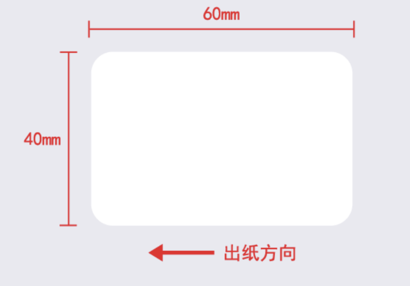
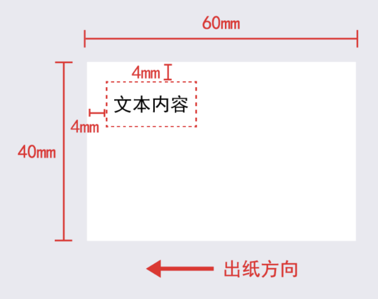
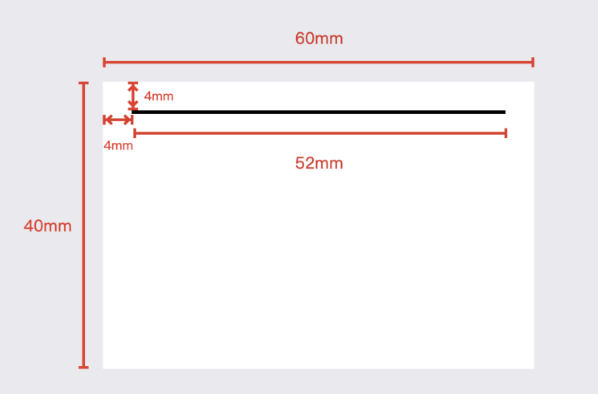
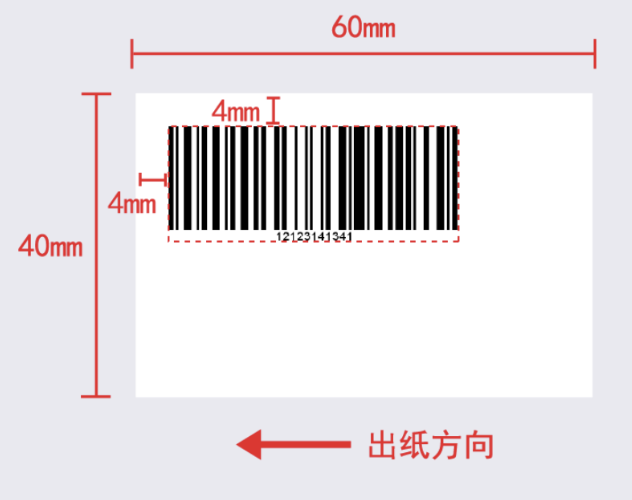
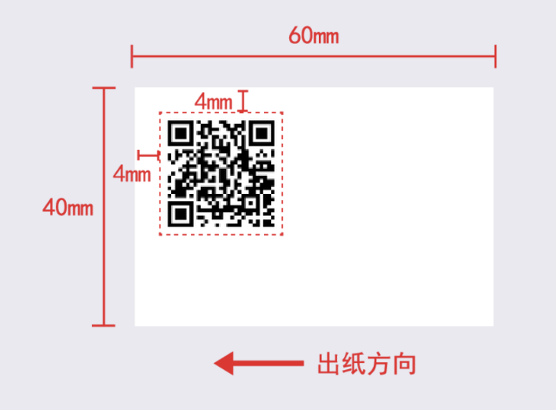
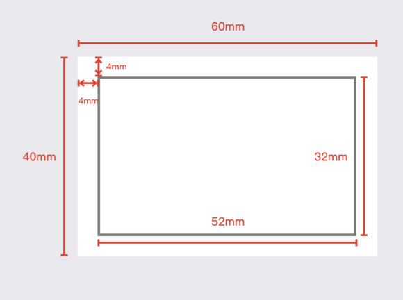

# Niimbot Printer SDK - Content Typesetting

## Table of Contents

- [1. Setting Label Size and View Direction](#1-setting-label-size-and-view-direction)
  - [1.1 0° Rotation Example](#11-0-rotation-example)
    - [1.1.1 Android Example](#111-android-example)
    - [1.1.2 iOS Example](#112-ios-example)
    - [1.1.3 PC-C# Example](#113-pc-c-example)
    - [1.1.4 PC-C++ Example](#114-pc-c-example)
    - [1.1.5 PC-WEB Example](#115-pc-web-example)
    - [1.1.6 WeChat Mini Program Example](#116-wechat-mini-program-example)
  - [1.2 90° Rotation Example](#12-90-rotation-example)
    - [1.2.1 Android Example](#121-android-example)
    - [1.2.2 iOS Example](#122-ios-example)
    - [1.2.3 PC-C# Example](#123-pc-c-example)
    - [1.2.4 PC-C++ Example](#124-pc-c-example)
    - [1.2.5 PC-WEB Example](#125-pc-web-example)
    - [1.2.6 WeChat Mini Program Example](#126-wechat-mini-program-example)
- [2. Element Drawing](#2-element-drawing)
  - [2.1 Text Box Drawing](#21-text-box-drawing)
  - [2.2 Line Drawing](#22-line-drawing)
  - [2.3 1D Barcode (Bar Code) Drawing](#23-1d-barcode-bar-code-drawing)
  - [2.4 2D Barcode Drawing](#24-2d-barcode-drawing)
  - [2.5 Shape Drawing](#25-shape-drawing)
  - [2.6 Image Drawing](#26-image-drawing)
- [3. Label Physical Size and Image Size Conversion](#3-label-physical-size-and-image-size-conversion)
- [4. Notes for Printing Images (Non-LOGO)](#4-notes-for-printing-images-non-logo)
  - [4.1 Image Size](#41-image-size)
  - [4.2 Image Background](#42-image-background)

## 1. Setting Label Size and View Direction

The rotation angle for converting from label view to editor view is in the reverse direction. The width and height parameters in the API refer to the width and height of the editor view.

### 1.1 0° Rotation Example

Using labels with dimensions 40-60mm as an example (unit: mm)

Sample code as follows:

#### 1.1.1 Android Example

```java
/*
 * Set canvas size
 *
 * @param width Canvas width
 * @param height Canvas height
 * @param orientation Canvas rotation angle
 * @param fontDir Font directory path not used, passing "" is sufficient
 *
 */
api.drawEmptyLabel(40, 60, 0, "");
```

#### 1.1.2 iOS Example

```objective-c
/// Drawing board
/// @param width Width
/// @param height Height
/// @param horizontalShift Horizontal offset, currently not effective
/// @param verticalShift Vertical offset, currently not effective 
/// @param rotate Rotation angle
/// @param font Use font path, passing nil is sufficient
[JCAPI initDrawingBoard:40 withHeight:60 withHorizontalShift:0 withVerticalShift:0 rotate:0 font:@""];
```

#### 1.1.3 PC-C# Example

```csharp
// Drawing board
// @param width Width
// @param height Height
// @param rotate Rotation angle
// @param font Use font
// @param horizontalShift Horizontal offset, currently not effective
// @param verticalShift Vertical offset, currently not effective
Printer.InitDrawingBoard(40, 60, 0, "ZT001.ttf", 0, 0);
```

#### 1.1.4 PC-C++ Example

```cpp
// Drawing board
// @param width Width
// @param height Height
// @param rotate Rotation angle
// @param font Use font
// @param horizontalShift Horizontal offset, currently not effective
// @param verticalShift Vertical offset, currently not effective
Printer::InitDrawingBoard(40, 60, 0, "ZT001.ttf", 0, 0);
```

#### 1.1.5 PC-WEB Example

```javascript
var data = {
  InitDrawingBoardParam: {
    "width": 40,//Canvas width
    "height": 60,//Canvas height
    "rotate": 0,//Canvas rotation angle
    "path": "ZT001.ttf",//Font
    "verticalShift": 0,//Horizontal offset, currently not effective
    "HorizontalShift": 0//Vertical offset, currently not effective
  }
}

//Initialize canvas
InitDrawingBoard(data.InitDrawingBoardParam, function () {
});
```

#### 1.1.6 WeChat Mini Program Example

```javascript
/**
 * Drawing before printing
 * @param {*} canvasId Canvas ID
 * @param {*} compent Canvas JS object
 * @param {*} canvasWidth Canvas width
 * @param {*} canvasHeight Canvas height
 * @param {*} roration Rotation angle
 */
JCAPI.startDrawLabel('test',this,40,60,0);
```

Editor view example:


### 1.2 90° Rotation Example

Using labels with dimensions 40-60mm as an example (unit: mm)

Sample code as follows:

#### 1.2.1 Android Example

```java
/*
 * Set canvas size
 *
 * @param width Canvas width
 * @param height Canvas height
 * @param orientation Canvas rotation angle
 * @param fontDir Font directory path not used, passing "" is sufficient
 *
 */
api.drawEmptyLabel(60, 40, 90, "");
```

#### 1.2.2 iOS Example

```objective-c
/// Drawing board
/// @param width Width
/// @param height Height
/// @param horizontalShift Horizontal offset, currently not effective
/// @param verticalShift Vertical offset, currently not effective 
/// @param rotate Rotation angle
/// @param font Use font path, passing nil is sufficient
[JCAPI initDrawingBoard:60 withHeight:40 withHorizontalShift:0 withVerticalShift:0 rotate:90 font:@""];
```

#### 1.2.3 PC-C# Example

```csharp
// Drawing board
// @param width Width
// @param height Height
// @param rotate Rotation angle
// @param font Use font
// @param horizontalShift Horizontal offset, currently not effective
// @param verticalShift Vertical offset, currently not effective
Printer.InitDrawingBoard(60, 40, 90, "ZT001.ttf", 0, 0);
```

#### 1.2.4 PC-C++ Example

```cpp
// Drawing board
// @param width Width
// @param height Height
// @param rotate Rotation angle
// @param font Use font
// @param horizontalShift Horizontal offset, currently not effective
// @param verticalShift Vertical offset, currently not effective
Printer::InitDrawingBoard(60, 40, 90, "ZT001.ttf", 0, 0);
```

#### 1.2.5 PC-WEB Example

```javascript
var data = {
  InitDrawingBoardParam: {
    "width": 60,//Canvas width
    "height": 40,//Canvas height
    "rotate": 90,//Canvas rotation angle
    "path": "ZT001.ttf",//Font
    "verticalShift": 0,//Horizontal offset, currently not effective
    "HorizontalShift": 0//Vertical offset, currently not effective
  }
}

//Initialize canvas
InitDrawingBoard(data.InitDrawingBoardParam, function () {
});
```



#### 1.2.6 WeChat Mini Program Example

```javascript
/**
 * Drawing before printing
 * @param {*} canvasId Canvas ID
 * @param {*} compent Canvas JS object
 * @param {*} canvasWidth Canvas width
 * @param {*} canvasHeight Canvas height
 * @param {*} roration Rotation angle
 */
JCAPI.startDrawLabel('test',this,60,40,90);
```

Editor view example:


## 2. Element Drawing

The drawing of elements is based on the current editor view. The origin (0,0) is in the top left corner of the editor view. The parameters in the API apply to the text frame, which is the alignment of text relative to the text frame.

### 2.1 Text Box Drawing

Sample code as follows:

#### 2.1.1 Android Example

```java
api.drawEmptyLabel(60, 40, 90, "");
/**
 * Draw text
 *
 * @param x Position x
 * @param y Position y
 * @param width Width
 * @param height Height
 * @param value Content
 * @param fontFamily Font name, default font is used when empty string or null
 * @param fontSize Font size
 * @param rotate Rotation
 * @param textAlignHorizontal Horizontal alignment method: 0: Left align 1: Center align 2: Right align
 * @param textAlignVertical Vertical alignment method: 0: Top align 1: Vertical center 2: Bottom align
 * @param lineModel 1: Fixed height, content size auto-adapts (character/font spacing/line spacing proportionally scaled) 2: Fixed width, height auto-adapts 3: Fixed height, content exceeding area adds...4: Fixed height, content exceeding area directly truncated 6: Fixed height, content exceeding predicted height auto-shrinks (character/font spacing/line spacing proportionally scaled)
 * @param letterSpace Standard spacing between characters, unit mm
 * @param lineSpace Line spacing (times), unit mm
 * @param mFontStyles Font style [bold, italic, underline, strikethrough (reserved) ]
 */
api.drawLabelText(4.0F, 4.0F, 20.0F, 10.0F, "Text content", "", 3.0F, 0, 1, 1, 6, 0.0F, 1.0F, new boolean[]{false, false, false, false});
```

#### 2.1.2 iOS Example

```objective-c
/// Drawing board
/// @param width Width
/// @param height Height
/// @param horizontalShift Horizontal offset, currently not effective
/// @param verticalShift Vertical offset, currently not effective 
/// @param rotate Rotation angle
/// @param font Use font path, default nil
[JCAPI initDrawingBoard:60 withHeight:40 withHorizontalShift:0 withVerticalShift:0 rotate:90 font:@""];
/// Draw text
/// @param x Horizontal starting point
/// @param y Vertical starting point
/// @param w Width
/// @param h Height
/// @param text Content
/// @param fontFamily Font
/// @param fontSize Font size
/// @param rotate Rotation
/// @param textAlignHorizonral Text horizontal alignment method
/// @param textAlignVertical Text vertical alignment method
/// @param lineMode Line wrapping mode  1: Fixed height, content size auto-adapts (character/font spacing/line spacing proportionally scaled) 2: Fixed width, height auto-adapts 3: Fixed height, content exceeding area adds...4: Fixed height, content exceeding area directly truncated 6: Fixed height, content exceeding predicted height auto-shrinks (character/font spacing/line spacing proportionally scaled)
/// @param letterSpacing Character spacing
/// @param lineSpacing Line spacing
/// @param fontStyles [italic, bold, underline, strikethrough (not used)]
[JCAPI drawLableText:4.0 withY:4.0 withWidth: 20.0 withHeight:10.0 withString:@"Text content" withFontFamily:@"Song" withFontSize:3.0 withRotate:0 withTextAlignHorizonral:1 withTextAlignVertical:1 withLineMode:6 withLetterSpacing:0 withLineSpacing:1 withFontStyle: @[@0,@0,@0,@0]];
```

#### 2.1.3 PC-C# Example

```csharp
Printer.InitDrawingBoard(60, 40, 90, "ZT001.ttf", 0, 0);
string str = File.ReadAllText(@"Print content");
/*
 * Draw text
 *
 * @param x Horizontal coordinate
 * @param y Vertical coordinate
 * @param width Width, unit mm
 * @param height Height, unit mm
 * @param value Text to draw (UTF8)
 * @param fontFamily Font, default "ZT001.ttf"
 * @param fontSize Font size
 * @param rotate Rotation angle
 * @param textAlignHorizonral Horizontal alignment method, 0: Left align 1: Center align 2: Right align
 * @param textAlignVertical Vertical alignment method, 0: Top align 1: Vertical center 2: Bottom align
 * @param lineMode Line mode, default 6
 * 1: Fixed height, content size auto-adapts (character/font spacing/line spacing proportionally scaled)
 * 2: Fixed width, height auto-adapts
 * 3: Fixed height, content exceeding area adds...
 * 4: Fixed height, content exceeding area directly truncated
 * 6: Fixed height, content exceeding predicted height auto-shrinks (character/font spacing/line spacing proportionally scaled)
 * @param letterSpacing Character spacing, unit mm
 * @param lineSpacing Line spacing, unit mm
 * @param fontStyle Font format (bold, italic, underline), data format [italic, bold, underline, reserved]
 * @return
 */
Printer.DrawLableText(4, 4, 20, 10, Encoding.UTF8.GetBytes(str + (char)0), "ZT001.ttf", 4, 0, 1, 1, 6, 0, 1.0F, new bool[] { false, false, false, false});
```

#### 2.1.4 PC-C++ Example

```cpp
Printer::InitDrawingBoard(60, 40, 90, "ZT001.ttf", 0, 0);
std::string str = u8"Print content";
/*
 * Draw text
 *
 * @param x Horizontal coordinate
 * @param y Vertical coordinate
 * @param width Width, unit mm
 * @param height Height, unit mm
 * @param value Text to draw (UTF8)
 * @param fontFamily Font, default "ZT001.ttf"
 * @param fontSize Font size
 * @param rotate Rotation angle
 * @param textAlignHorizonral Horizontal alignment method, 0: Left align 1: Center align 2: Right align
 * @param textAlignVertical Vertical alignment method, 0: Top align 1: Vertical center 2: Bottom align
 * @param lineMode Line mode, default 6
 * 1: Fixed height, content size auto-adapts (character/font spacing/line spacing proportionally scaled)
 * 2: Fixed width, height auto-adapts
 * 3: Fixed height, content exceeding area adds...
 * 4: Fixed height, content exceeding area directly truncated
 * 6: Fixed height, content exceeding predicted height auto-shrinks (character/font spacing/line spacing proportionally scaled)
 * @param letterSpacing Character spacing, unit mm
 * @param lineSpacing Line spacing, unit mm
 * @param fontStyle Font format (bold, italic, underline), data format [italic, bold, underline, reserved]
 * @return
 */
Printer::DrawLableText(4, 4, 20, 10, Encoding.UTF8.GetBytes(str + (char)0), "ZT001.ttf", 4, 0, 1, 1, 6, 0, 1.0F, new bool[] { false, false, false, false});
```



### 2.2 Line Drawing

#### 2.2.1 Android Example

```java
api.drawEmptyLabel(60, 40, 90, "");
/**
 * Draw line
 *
 * @param x Position x
 * @param y Position y
 * @param width Line width
 * @param height Line height
 * @param lineWidth Line thickness
 * @param rotate Rotation angle
 * @param lineType Line type: 1: Solid line; 2: Dashed line
 * @param dashWidth Dash width, array of two elements, representing the lengths of solid and empty segments
 */
api.drawLableLine(4.0F, 15.0F, 30.0F, 0.0F, 0.3F, 0, 1, new float[]{0.0F, 0.0F});
```

#### 2.2.2 iOS Example

```objective-c
/// Drawing board
[JCAPI initDrawingBoard:60 withHeight:40 withHorizontalShift:0 withVerticalShift:0 rotate:90 font:@""];
/// Draw line
/// @param x Horizontal starting point
/// @param y Vertical starting point
/// @param w Width
/// @param h Height
/// @param lineWidth Line thickness
/// @param rotate Rotation angle
/// @param lineType Line type: 1: Solid line; 2: Dashed line
/// @param dashWidth Dash width, array of two elements, representing the lengths of solid and empty segments
[JCAPI DrawLableLine:4.0 withY:15.0 withWidth:30.0 withHeight:0.0 withLineWidth:0.3 withRotate:0 withLineType:1 withDashWidth:@[@0, @0]];
```



### 2.3 1D Barcode (Bar Code) Drawing

#### 2.3.1 Android Example

```java
api.drawEmptyLabel(60, 40, 90, "");
/**
 * Draw 1D barcode
 *
 * @param x Position x
 * @param y Position y
 * @param width Barcode width
 * @param height Barcode height
 * @param value Barcode content
 * @param fontSize Text font size
 * @param rotate Rotation angle
 * @param codeType Barcode type, options:
 *          20:CODE128, 21:UPC-A, 22:UPC-E, 23:EAN8, 24:EAN13
 *          25:CODE93, 26:CODE39, 27:CODEBAR, 28:ITF25
 * @param textHeight Text height
 * @param textPosition Text display position: 0:Bottom 1:Top 2:None
 */
api.drawLableBarCode(4.0F, 20.0F, 30.0F, 8.0F, "1234567890", 2.0F, 0, 20, 4.0F, 0);
```

#### 2.3.2 iOS Example

```objective-c
/// Drawing board
[JCAPI initDrawingBoard:60 withHeight:40 withHorizontalShift:0 withVerticalShift:0 rotate:90 font:@""];
/// Draw 1D barcode
/// @param x Horizontal starting point
/// @param y Vertical starting point
/// @param w Width
/// @param h Height
/// @param text Content
/// @param fontSize Font size
/// @param rotate Rotation angle
/// @param codeType Barcode type, options:
///          20:CODE128, 21:UPC-A, 22:UPC-E, 23:EAN8, 24:EAN13
///          25:CODE93, 26:CODE39, 27:CODEBAR, 28:ITF25
/// @param textHeight Text height
/// @param textPosition Text display position: 0:Bottom 1:Top 2:None
[JCAPI drawLableBarCode:4.0 withY:20.0 withWidth:30.0 withHeight:8.0 withString:@"1234567890" withFontSize:2.0 withRotate:0 withCodeType:20 withTextHeight:4.0 withTextPosition:0];
```

#### 2.3.3 PC-C# Example

```csharp
Printer.InitDrawingBoard(60, 40, 90, "ZT001.ttf", 0, 0);
/*
 * Draw 1D barcode
 *
 * @param x Horizontal coordinate
 * @param y Vertical coordinate
 * @param width Width, unit mm
 * @param height Height, unit mm
 * @param value Barcode content
 * @param fontSize Text font size
 * @param rotate Rotation angle
 * @param codeType Barcode type, options:
 *          20:CODE128, 21:UPC-A, 22:UPC-E, 23:EAN8, 24:EAN13
 *          25:CODE93, 26:CODE39, 27:CODEBAR, 28:ITF25
 * @param textHeight Text height
 * @param textPosition Text display position: 0:Bottom 1:Top 2:None
 */
Printer.DrawLableBarCode(4, 20, 30, 8, "1234567890", 2.0F, 0, 20, 4.0F, 0);
```

#### 2.3.4 PC-C++ Example

```cpp
Printer::InitDrawingBoard(60, 40, 90, "ZT001.ttf", 0, 0);
/*
 * Draw 1D barcode
 *
 * @param x Horizontal coordinate
 * @param y Vertical coordinate
 * @param width Width, unit mm
 * @param height Height, unit mm
 * @param value Barcode content
 * @param fontSize Text font size
 * @param rotate Rotation angle
 * @param codeType Barcode type, options:
 *          20:CODE128, 21:UPC-A, 22:UPC-E, 23:EAN8, 24:EAN13
 *          25:CODE93, 26:CODE39, 27:CODEBAR, 28:ITF25
 * @param textHeight Text height
 * @param textPosition Text display position: 0:Bottom 1:Top 2:None
 */
Printer::DrawLableBarCode(4, 20, 30, 8, "1234567890", 2.0F, 0, 20, 4.0F, 0);
```

#### 2.3.5 PC-WEB Example

```javascript
var data = {
  InitDrawingBoardParam: {
    "width": 60,
    "height": 40,
    "rotate": 90,
    "path": "ZT001.ttf",
    "verticalShift": 0,
    "HorizontalShift": 0
  },
  DrawBarcodeParam: {
    "x": 4.0,
    "y": 4.0, 
    "width": 38.0,
    "height": 15.0,
    "value": "1212314341",
    "fontSize": 2.0,
    "rotate": 0,
    "codeType": 20,
    "textHeight": 2.5,
    "textPosition": 0
  }
}

// Initialize canvas
InitDrawingBoard(data.InitDrawingBoardParam, function () {
  // Draw 1D barcode
  DrawLableBarCode(data.DrawBarcodeParam, function () {
  });
});
```

#### 2.3.6 WeChat Mini Program Example

```javascript
// Initialize drawing
JCAPI.startDrawLabel('test', this, 60, 40, 90);

// Draw 1D barcode
JCAPI.drawBarCode('test', this, 4.0, 4.0, 38.0, 15.0, "1212314341", 2.0, 0, 20, 2.5, 0);

// End drawing
JCAPI.endDrawLabel();
```

The parameters for drawLableBarCode/DrawLableBarCode/drawBarCode are:
- x: Horizontal coordinate relative to the editor view X-axis
- y: Vertical coordinate relative to the editor view Y-axis
- width: Barcode width
- height: Barcode height
- value: Barcode content
- fontSize: Text font size
- rotate: Rotation angle
- codeType: Barcode type (20:CODE128, 21:UPC-A, 22:UPC-E, 23:EAN8, 24:EAN13, 25:CODE93, 26:CODE39, 27:CODEBAR, 28:ITF25)
- textHeight: Text height
- textPosition: Text display position (0:Bottom display, 1:Top display, 2:No display)

Example output image (barcode actual drawing effect does not include the frame line):



### 2.4 2D Barcode Drawing

#### 2.4.1 Android Example

```java
api.drawEmptyLabel(60, 40, 90, "");
/**
 * Draw 2D barcode (QR code)
 *
 * @param x Position x
 * @param y Position y
 * @param width QR code width
 * @param height QR code height
 * @param value QR code content
 * @param rotate Rotation angle, only supports 0, 90, 180, 270
 * @param codeType QR code type: 31:QR_CODE, 32:PDF417, 33:DATA_MATRIX, 34:AZTEC
 */
api.drawLableQrCode(25.0F, 14.0F, 12.0F, 12.0F, "https://www.example.com", 0, 31);
```

#### 2.4.2 iOS Example

```objective-c
/// Drawing board
[JCAPI initDrawingBoard:60 withHeight:40 withHorizontalShift:0 withVerticalShift:0 rotate:90 font:@""];
/// Draw 2D barcode (QR code)
/// @param x Horizontal starting point
/// @param y Vertical starting point
/// @param w Width
/// @param h Height
/// @param text Content
/// @param rotate Rotation angle, only supports 0, 90, 180, 270
/// @param codeType QR code type: 31:QR_CODE, 32:PDF417, 33:DATA_MATRIX, 34:AZTEC
[JCAPI drawLableQrCode:25.0 withY:14.0 withWidth:12.0 withHeight:12.0 withString:@"https://www.example.com" withRotate:0 withCodeType:31];
```

#### 2.4.3 PC-C# Example

```csharp
Printer.InitDrawingBoard(60, 40, 90, "ZT001.ttf", 0, 0);
/*
 * Draw 2D barcode
 *
 * @param x Horizontal coordinate
 * @param y Vertical coordinate
 * @param width Width, unit mm
 * @param height Height, unit mm
 * @param value QR code content
 * @param rotate Rotation angle, only supports 0, 90, 180, 270
 * @param codeType QR code type: 31:QR_CODE, 32:PDF417, 33:DATA_MATRIX, 34:AZTEC
 */
Printer.DrawLableQrCode(25, 14, 12, 12, "https://www.example.com", 0, 31);
```

#### 2.4.4 PC-C++ Example

```cpp
Printer::InitDrawingBoard(60, 40, 90, "ZT001.ttf", 0, 0);
/*
 * Draw 2D barcode
 *
 * @param x Horizontal coordinate
 * @param y Vertical coordinate
 * @param width Width, unit mm
 * @param height Height, unit mm
 * @param value QR code content
 * @param rotate Rotation angle, only supports 0, 90, 180, 270
 * @param codeType QR code type: 31:QR_CODE, 32:PDF417, 33:DATA_MATRIX, 34:AZTEC
 */
Printer::DrawLableQrCode(25, 14, 12, 12, Encoding.UTF8.GetBytes("https://www.example.com" + (char)0), 0, 31);
```

#### 2.4.5 PC-WEB Example

```javascript
var data = {
  InitDrawingBoardParam: {
    "width": 60,
    "height": 40,
    "rotate": 90,
    "path": "ZT001.ttf",
    "verticalShift": 0,
    "HorizontalShift": 0
  },
  DrawQRCodeParam: {
    "x": 25.0,
    "y": 14.0,
    "width": 12.0,
    "height": 12.0,
    "value": "https://www.example.com",
    "rotate": 0,
    "codeType": 31
  }
}

// Initialize canvas
InitDrawingBoard(data.InitDrawingBoardParam, function () {
  // Draw QR code
  DrawLableQrCode(data.DrawQRCodeParam, function () {
  });
});
```

#### 2.4.6 WeChat Mini Program Example

```javascript
// Initialize drawing
JCAPI.startDrawLabel('test', this, 60, 40, 90);

// Draw QR code
JCAPI.drawQrCode('test', this, 25.0, 14.0, 12.0, 12.0, "https://www.example.com", 0, 31);

// End drawing
JCAPI.endDrawLabel();
```

The parameters for drawLableQrCode/DrawLableQrCode/drawQrCode are:
- x: Horizontal coordinate relative to the editor view X-axis
- y: Vertical coordinate relative to the editor view Y-axis
- width: QR code width
- height: QR code height
- value: QR code content
- rotate: Rotation angle, only supports 0, 90, 180, 270
- codeType: QR code type (31:QR_CODE, 32:PDF417, 33:DATA_MATRIX, 34:AZTEC)

Example output image (QR code actual drawing effect):



### 2.5 Shape Drawing

#### 2.5.1 Android Example

```java
api.drawEmptyLabel(60, 40, 90, "");
/**
 * Draw a shape
 *
 * @param x Position x
 * @param y Position y
 * @param width Shape width
 * @param height Shape height
 * @param lineWidth Line width
 * @param cornerRadius Corner radius (for rounded rectangle)
 * @param rotate Rotation angle, only supports 0, 90, 180, 270
 * @param graphType Shape type: 1-Circle, 2-Oval, 3-Rectangle, 4-Rounded Rectangle
 * @param lineType Line type: 1-Solid line, 2-Dashed line (dash-to-space ratio 1:1)
 * @param dashWidth Dash width, array of two elements: [solid segment length, empty segment length]
 */
api.drawLableGraph(30.0F, 20.0F, 15.0F, 10.0F, 0.3F, 2.0F, 0, 4, 1, new float[]{0.0F, 0.0F});
```

#### 2.5.2 iOS Example

```objective-c
/// Drawing board
[JCAPI initDrawingBoard:60 withHeight:40 withHorizontalShift:0 withVerticalShift:0 rotate:90 font:@""];
/// Draw a shape
/// @param x Horizontal starting point
/// @param y Vertical starting point
/// @param w Width
/// @param h Height
/// @param lineWidth Line width
/// @param cornerRadius Corner radius (for rounded rectangle)
/// @param rotate Rotation angle, only supports 0, 90, 180, 270
/// @param graphType Shape type: 1-Circle, 2-Oval, 3-Rectangle, 4-Rounded Rectangle
/// @param lineType Line type: 1-Solid line, 2-Dashed line (dash-to-space ratio 1:1)
/// @param dashWidth Dash width, array of two elements: [solid segment length, empty segment length]
[JCAPI DrawLableGraph:30.0 withY:20.0 withWidth:15.0 withHeight:10.0 withLineWidth:0.3 withCornerRadius:2.0 withRotate:0 withGraphType:4 withLineType:1 withDashWidth:@[@0, @0]];
```

#### 2.5.3 PC-C# Example

```csharp
Printer.InitDrawingBoard(60, 40, 90, "ZT001.ttf", 0, 0);
/*
 * Draw a shape
 *
 * @param x Horizontal coordinate
 * @param y Vertical coordinate
 * @param width Width, unit mm
 * @param height Height, unit mm
 * @param lineWidth Line width
 * @param cornerRadius Corner radius (for rounded rectangle)
 * @param rotate Rotation angle, only supports 0, 90, 180, 270
 * @param graphType Shape type: 1-Circle, 2-Oval, 3-Rectangle, 4-Rounded Rectangle
 * @param lineType Line type: 1-Solid line, 2-Dashed line (dash-to-space ratio 1:1)
 * @param dashWidth Dash width, array of two numbers: [solid segment length, empty segment length]
 */
Printer.DrawLableGraph(30, 20, 15, 10, 0.3F, 2.0F, 0, 4, 1, new float[] { 0.0F, 0.0F });
```

#### 2.5.4 PC-C++ Example

```cpp
Printer::InitDrawingBoard(60, 40, 90, "ZT001.ttf", 0, 0);
/*
 * Draw a shape
 *
 * @param x Horizontal coordinate
 * @param y Vertical coordinate
 * @param width Width, unit mm
 * @param height Height, unit mm
 * @param lineWidth Line width
 * @param cornerRadius Corner radius (for rounded rectangle)
 * @param rotate Rotation angle, only supports 0, 90, 180, 270
 * @param graphType Shape type: 1-Circle, 2-Oval, 3-Rectangle, 4-Rounded Rectangle
 * @param lineType Line type: 1-Solid line, 2-Dashed line (dash-to-space ratio 1:1)
 * @param dashWidth Dash width, array of two numbers: [solid segment length, empty segment length]
 */
Printer::DrawLableGraph(30, 20, 15, 10, 0.3F, 2.0F, 0, 4, 1, new float[] { 0.0F, 0.0F });
```

#### 2.5.5 PC-WEB Example

```javascript
var data = {
  InitDrawingBoardParam: {
    "width": 60,
    "height": 40,
    "rotate": 90,
    "path": "ZT001.ttf",
    "verticalShift": 0,
    "HorizontalShift": 0
  },
  DrawGraphParam: {
    "x": 30.0,
    "y": 20.0,
    "width": 15.0,
    "height": 10.0,
    "lineWidth": 0.3,
    "cornerRadius": 2.0,
    "rotate": 0,
    "graphType": 4,
    "lineType": 1,
    "dashWidth": [0.0, 0.0]
  }
}

// Initialize canvas
InitDrawingBoard(data.InitDrawingBoardParam, function () {
  // Draw shape
  DrawLableGraph(data.DrawGraphParam, function () {
  });
});
```

#### 2.5.6 WeChat Mini Program Example

```javascript
// Initialize drawing
JCAPI.startDrawLabel('test', this, 60, 40, 90);

// Draw rectangle (shape)
JCAPI.drawRectangle(4, 4, 52, 32, 0.5, false,, 0);

// End drawing
JCAPI.endDrawLabel();
```

The parameters for WeChat Mini Program drawRectangle are:
- x: Horizontal coordinate relative to the editor view X-axis
- y: Vertical coordinate relative to the editor view Y-axis
- width: Rectangle width
- height: Rectangle height
- lineWidth: Line width
- isFilled: Whether to fill the rectangle
- rotation: Rotation angle

Note that for WeChat Mini Program, there are specialized methods for different shapes (drawRectangle, drawCircle, etc.) rather than a generic shape drawing method.

Example output image for the shape drawing:



### 2.6 Image Drawing

#### 2.6.1 Android Example

```java
api.drawEmptyLabel(60, 40, 90, "");
/**
 * Draw an image
 *
 * @param x Position x
 * @param y Position y
 * @param width Image width
 * @param height Image height
 * @param imageData Image data (Base64 encoded)
 * @param rotate Rotation angle, only supports 0, 90, 180, 270
 * @param algorithm Image processing algorithm (1: default)
 * @param threshold Threshold value (127: default)
 */
api.drawLableImage(40.0F, 20.0F, 15.0F, 15.0F, imageBase64, 0, 1, 127.0F);
```

#### 2.6.2 iOS Example

```objective-c
/// Drawing board
[JCAPI initDrawingBoard:60 withHeight:40 withHorizontalShift:0 withVerticalShift:0 rotate:90 font:@""];
/// Draw an image
/// @param x Horizontal starting point
/// @param y Vertical starting point
/// @param w Width
/// @param h Height
/// @param imageData Image data (Base64 encoded)
/// @param rotate Rotation angle, only supports 0, 90, 180, 270
/// @param imageProcessingType Image processing algorithm (1: default)
/// @param imageProcessingValue Threshold value (127: default)
[JCAPI DrawLableImage:40.0 withY:20.0 withWidth:15.0 withHeight:15.0 withImageData:imageBase64 withRotate:0 withImageProcessingType:1 withImageProcessingValue:127.0];
```

#### 2.6.3 PC-C# Example

```csharp
Printer.InitDrawingBoard(60, 40, 90, "ZT001.ttf", 0, 0);
/*
 * Draw an image
 *
 * @param x Horizontal coordinate
 * @param y Vertical coordinate
 * @param width Width, unit mm
 * @param height Height, unit mm
 * @param imageData Image data (Base64 encoded)
 * @param rotate Rotation angle, only supports 0, 90, 180, 270
 * @param algorithm Image processing algorithm (1: default)
 * @param threshold Threshold value (127: default)
 */
Printer.DrawLableImage(40, 20, 15, 15, imageBase64, 0, 1, 127.0F);
```

#### 2.6.4 PC-C++ Example

```cpp
Printer::InitDrawingBoard(60, 40, 90, "ZT001.ttf", 0, 0);
/*
 * Draw an image
 *
 * @param x Horizontal coordinate
 * @param y Vertical coordinate
 * @param width Width, unit mm
 * @param height Height, unit mm
 * @param imageData Image data (Base64 encoded)
 * @param rotate Rotation angle, only supports 0, 90, 180, 270
 * @param algorithm Image processing algorithm (1: default)
 * @param threshold Threshold value (127: default)
 */
Printer::DrawLableImage(40, 20, 15, 15, imageBase64, 0, 1, 127.0F);
```

#### 2.6.5 PC-WEB Example

```javascript
var data = {
  InitDrawingBoardParam: {
    "width": 60,
    "height": 40,
    "rotate": 90,
    "path": "ZT001.ttf",
    "verticalShift": 0,
    "HorizontalShift": 0
  },
  DrawImageParam: {
    "x": 40.0,
    "y": 20.0,
    "width": 15.0,
    "height": 15.0,
    "imageData": "Base64EncodedImageData", // Replace with actual base64 image data
    "rotate": 0,
    "algorithm": 1,
    "threshold": 127.0
  }
}

// Initialize canvas
InitDrawingBoard(data.InitDrawingBoardParam, function () {
  // Draw image
  DrawLableImage(data.DrawImageParam, function () {
  });
});
```

#### 2.6.6 WeChat Mini Program Example

```javascript
// Initialize drawing
JCAPI.startDrawLabel('test', this, 60, 40, 90);

// Draw image
JCAPI.drawImage('test', this, 40.0, 20.0, 15.0, 15.0, "Base64EncodedImageData", 0, 1, 127.0);

// End drawing
JCAPI.endDrawLabel();
```

The parameters for drawLableImage/DrawLableImage/drawImage are:
- x: Horizontal coordinate relative to the editor view X-axis
- y: Vertical coordinate relative to the editor view Y-axis
- width: Image width
- height: Image height
- imageData: Image data (Base64 encoded string without data URI prefix)
- rotate: Rotation angle, only supports 0, 90, 180, 270
- algorithm/imageProcessingType: Image processing algorithm (1: default)
- threshold/imageProcessingValue: Threshold value for black and white conversion (127: default, range 0-255)

Example output image (actual drawing effect of an image):


## 3. Label Physical Size and Image Size Conversion

The conversion between the physical size of the label and the image size depends on the printer's resolution. Different printer models have different conversion ratios:

| Model | Printer Resolution | MM to Pixel Conversion Ratio |
|-------|-------------------|------------------------------|
| B3S | 200dpi | 1mm = 8px |
| B21/B203/B1 | 200dpi | 1mm = 8px |
| B50/B50W | 200dpi | 1mm = 8px |
| B32 | 300dpi | 1mm = 11.81px |
| K3/K3W | 200dpi | 1mm = 8px |
| M2 | 300dpi | 1mm = 11.81px |
| B21Pro | 300dpi | 1mm = 11.81px |
| S6 | 300dpi | 1mm = 11.81px |

When converting from the physical size of a label to image pixels, you need to multiply the size in millimeters by the conversion ratio.

For example, for a printer with 200dpi resolution:
- 40mm width = 40 × 8 = 320 pixels
- 60mm height = 60 × 8 = 480 pixels

For a printer with 300dpi resolution:
- 40mm width = 40 × 11.81 = 472.4 pixels
- 60mm height = 60 × 11.81 = 708.6 pixels

The SDK provides utility methods for these conversions:

```objective-c
// Convert millimeters to pixels
+ (CGFloat)mmToPixel:(CGFloat)mm;

// Convert pixels to millimeters
+ (CGFloat)pixelToMm:(CGFloat)pixel;
```

## 4. Notes for Printing Images (Non-LOGO)

### 4.1 Image Size

When printing images, consider the following:
- Image resolution should match the printer resolution for optimal results
- Large images may be automatically scaled down to fit the label size
- For best results, prepare images that match the exact pixel dimensions needed based on the label size and printer resolution
- For color images, they will be converted to black and white for printing using the threshold parameter
- Maximum image size depends on printer model, but generally should be kept under 4MB after Base64 encoding

### 4.2 Image Background

When printing images, the background handling is important:
- Transparent backgrounds in images will be printed as white
- For best results with logos or graphics, use images with transparent backgrounds
- The contrast between the image and background should be high for clear printing
- Avoid using grayscale images with subtle differences that may not be distinguishable when printed
- The default threshold for black/white conversion is 127 (on a 0-255 range), which can be adjusted if needed
- **It is required to set the image background to white when printing images**

Some SDK implementations on certain platforms may not properly handle transparent images, leading to black blocks in the printed output. Similarly, dark backgrounds may also result in solid black printed areas. Always ensure images have white backgrounds for optimal printing results.

### 4.3 Image Format

The SDK supports various image formats, but the most reliable are:
- PNG: Best for logos and graphics with transparency
- JPEG: Good for photographs, but lacks transparency support
- BMP: Uncompressed format that works with all printers

The image data must be converted to Base64 format before being passed to the drawing functions. Do not include the data URI prefix (e.g., "data:image/png;base64,") in the Base64 string.

Example of converting an image to Base64 in various languages:

**iOS (Objective-C):**
```objective-c
UIImage *image = [UIImage imageNamed:@"logo.png"];
NSData *imageData = UIImagePNGRepresentation(image);
NSString *base64String = [imageData base64EncodedStringWithOptions:0];
```

**Android (Java):**
```java
Bitmap bitmap = BitmapFactory.decodeResource(getResources(), R.drawable.logo);
ByteArrayOutputStream byteArrayOutputStream = new ByteArrayOutputStream();
bitmap.compress(Bitmap.CompressFormat.PNG, 100, byteArrayOutputStream);
byte[] byteArray = byteArrayOutputStream.toByteArray();
String base64String = Base64.encodeToString(byteArray, Base64.DEFAULT);
```

**C#:**
```csharp
using System.IO;
using System.Drawing;
using System.Drawing.Imaging;

Bitmap bitmap = new Bitmap("logo.png");
using (MemoryStream ms = new MemoryStream())
{
    bitmap.Save(ms, ImageFormat.Png);
    byte[] imageBytes = ms.ToArray();
    string base64String = Convert.ToBase64String(imageBytes);
}
```

## 5. Printing Workflow Example

After creating all the elements on your label, you need to submit the print job. Here are examples of how to finalize and submit a print job for each platform:

### 5.1 Android Example

```java
// Set up printing parameters
api.setDevicePrintDarkness(3); // Print darkness/density setting (1-5, default 3)
api.setDevicePaperType(1);     // Paper type (1: Gap paper, 2: Black mark paper, etc.)

// Generate label data
String jsonData = api.generateLabelJson();

// Print the label with 1 copy
api.print(jsonData, 1, new IPrintCallback() {
    @Override
    public void onPrintSuccess() {
        // Print successful
        Log.d("Print", "Print job completed successfully");
    }
    
    @Override
    public void onPrintFailed(int errorCode, String errorMsg) {
        // Print failed
        Log.e("Print", "Print failed with error: " + errorMsg + " (code: " + errorCode + ")");
    }
});
```

### 5.2 iOS Example

```objective-c
// Set up error and status monitoring
[JCAPI getPrintingErrorInfo:^(NSString *printInfo) {
    NSLog(@"Printer error: %@", printInfo);
}];

// Set total quantity
int totalCopies = 1;
[JCAPI setTotalQuantityOfPrints:totalCopies];

// Start print job
[JCAPI startJob:3 withPaperStyle:1 withCompletion:^(BOOL isSuccess) {
    if (isSuccess) {
        // Initialize drawing board and add content as shown in previous examples
        [JCAPI initDrawingBoard:60 withHeight:40 withHorizontalShift:0 withVerticalShift:0 rotate:90 font:@""];
        
        // Add label elements (text, barcodes, etc.)
        // ...
        
        // Generate label JSON
        NSString *jsonStr = [JCAPI GenerateLableJson];
        
        // Submit for printing with 1 copy
        [JCAPI commit:jsonStr withOnePageNumbers:1 withComplete:^(BOOL isSuccess) {
            if (isSuccess) {
                NSLog(@"Print data submitted successfully");
                
                // Monitor print progress
                [JCAPI getPrintingCountInfo:^(NSDictionary *printDicInfo) {
                    NSString *totalCount = [printDicInfo valueForKey:@"totalCount"];
                    NSLog(@"Printed %@ of %d", totalCount, totalCopies);
                    
                    if ([totalCount intValue] == totalCopies) {
                        // End print job when all copies are printed
                        [JCAPI endPrint:^(BOOL isSuccess) {
                            NSLog(@"Print job ended: %@", isSuccess ? @"YES" : @"NO");
                        }];
                    }
                }];
            } else {
                NSLog(@"Failed to submit print data");
            }
        }];
    } else {
        NSLog(@"Failed to start print job");
    }
}];
```

### 5.3 PC-C# Example

```csharp
// Start print job
Printer.StartJob(3, 1, (bool success) => {
    if (success) {
        // Initialize drawing board and add content as shown in previous examples
        Printer.InitDrawingBoard(60, 40, 90, "ZT001.ttf", 0, 0);
        
        // Add label elements (text, barcodes, etc.)
        // ...
        
        // Generate label JSON
        string jsonStr = Printer.GenerateLabelJson();
        
        // Submit for printing with 1 copy
        Printer.Commit(jsonStr, 1, (bool printSuccess) => {
            if (printSuccess) {
                Console.WriteLine("Print data submitted successfully");
                
                // End print job
                Printer.EndPrint((bool endSuccess) => {
                    Console.WriteLine("Print job ended: " + endSuccess);
                });
            } else {
                Console.WriteLine("Failed to submit print data");
            }
        });
    } else {
        Console.WriteLine("Failed to start print job");
    }
});
```

### 5.4 PC-C++ Example

```cpp
// Start print job
Printer::StartJob(3, 1, [](bool success) {
    if (success) {
        // Initialize drawing board and add content as shown in previous examples
        Printer::InitDrawingBoard(60, 40, 90, "ZT001.ttf", 0, 0);
        
        // Add label elements (text, barcodes, etc.)
        // ...
        
        // Generate label JSON
        std::string jsonStr = Printer::GenerateLabelJson();
        
        // Submit for printing with 1 copy
        Printer::Commit(jsonStr.c_str(), 1, [](bool printSuccess) {
            if (printSuccess) {
                std::cout << "Print data submitted successfully" << std::endl;
                
                // End print job
                Printer::EndPrint([](bool endSuccess) {
                    std::cout << "Print job ended: " << (endSuccess ? "true" : "false") << std::endl;
                });
            } else {
                std::cout << "Failed to submit print data" << std::endl;
            }
        });
    } else {
        std::cout << "Failed to start print job" << std::endl;
    }
});
```

### 5.5 PC-WEB Example

```javascript
// Start print job
StartJob(3, 1, function(success) {
    if (success) {
        var data = {
            InitDrawingBoardParam: {
                "width": 60,
                "height": 40,
                "rotate": 90,
                "path": "ZT001.ttf",
                "verticalShift": 0,
                "HorizontalShift": 0
            }
        };
        
        // Initialize canvas
        InitDrawingBoard(data.InitDrawingBoardParam, function() {
            // Add label elements (text, barcodes, etc.)
            // ...
            
            // Generate label JSON
            var jsonStr = GenerateLabelJson();
            
            // Submit for printing with 1 copy
            Commit(jsonStr, 1, function(printSuccess) {
                if (printSuccess) {
                    console.log("Print data submitted successfully");
                    
                    // End print job
                    EndPrint(function(endSuccess) {
                        console.log("Print job ended: " + endSuccess);
                    });
                } else {
                    console.log("Failed to submit print data");
                }
            });
        });
    } else {
        console.log("Failed to start print job");
    }
});
```

### 5.6 WeChat Mini Program Example

```javascript
// Start drawing process
JCAPI.startDrawLabel('test', this, 60, 40, 90);

// Add elements to the label as shown in previous examples

// Generate print data
const jsonData = JCAPI.generateLabelJson('test', this);

// Print with 1 copy
JCAPI.print('test', this, jsonData, 1, {
  success: function() {
    // Print successful
    console.log('Printing successful');
  },
  fail: function(error) {
    // Print failed
    console.error('Printing failed', error);
  }
});
```

## 6. Printer Model Resolution Table

Below is a reference table of printer models and their corresponding resolutions, which is important for calculating pixel dimensions:

| No. | Printer Model | Printer Resolution | MM to Pixel Conversion Ratio |
|-----|--------------|-------------------|------------------------------|
| 001 | B3S | 200dpi | 1mm = 8px |
| 002 | B21/B203/B1 | 200dpi | 1mm = 8px |
| 003 | B50/B50W | 200dpi | 1mm = 8px |
| 004 | B32 | 300dpi | 1mm = 11.81px |
| 005 | K3/K3W | 200dpi | 1mm = 8px |
| 006 | M2 | 300dpi | 1mm = 11.81px |
| 007 | B21Pro | 300dpi | 1mm = 11.81px |
| 008 | S6 | 300dpi | 1mm = 11.81px |
| 009 | B31 | 300dpi | 1mm = 11.81px |
| 010 | K2 | 200dpi | 1mm = 8px |

## 7. Troubleshooting Common Issues

### 7.1 Print Quality Issues

If you encounter issues with print quality:

1. **Density Setting**: Adjust the printing density using the `blackRules` parameter in the `startJob` method:
   - Lower values (1-2) for lighter printing
   - Medium values (3) for normal printing (default)
   - Higher values (4-5) for darker printing

2. **Image Resolution**: Ensure images are properly sized for the printer resolution
   - For 200dpi printers: 8 pixels per mm
   - For 300dpi printers: 11.81 pixels per mm

3. **Threshold Value**: When printing images, adjust the threshold value:
   - Lower values (below 127) will result in more black areas
   - Higher values (above 127) will result in more white areas

### 7.2 Barcode Scanning Issues

If barcodes are not scanning properly:

1. **Barcode Width**: Ensure the barcode width is sufficient (typically at least 30mm for good readability)

2. **Height-to-Width Ratio**: Maintain proper proportions:
   - 1D barcodes: Height should be at least 1/3 of the width
   - QR codes: Width and height should be equal (square)

3. **Quiet Zone**: Leave sufficient white space around barcodes (at least 2mm on all sides)

### 7.3 Connection Issues

If you experience connection problems:

1. **Bluetooth Connection**:
   - Ensure the printer is powered on and in discovery mode
   - Check that the required permissions are properly declared in your app
   - Verify Bluetooth is enabled on the device

2. **WiFi Connection**:
   - Ensure the printer and device are on the same network
   - Verify the printer's IP address is correct
   - Check if there are any firewall settings blocking the connection

### 7.4 Error Handling and Debugging Tips

To effectively handle errors and debug printing issues, consider the following recommendations:

1. **Error Monitoring**: Always implement error callback handlers to receive and process printer errors:
   ```java
   // Android Example
   api.setPrinterErrorListener(new PrinterErrorListener() {
       @Override
       public void onError(int errorCode, String errorMessage) {
           Log.e("Printer", "Error " + errorCode + ": " + errorMessage);
           // Handle the error based on error code
       }
   });
   ```

2. **Common Error Codes**:
   - Error 1: Cover is open
   - Error 2: Out of paper
   - Error 6: Data error (submission failed or data transmission error)
   - Error 9: Printer is busy
   - Error 19: Failed to set print density (allowed printing, only reports errors)
   - Error 23: Printer disconnected

3. **Print Status Monitoring**: Monitor the print status to track printing progress:
   ```objective-c
   // iOS Example
   [JCAPI getPrintingCountInfo:^(NSDictionary *printDicInfo) {
       NSString *totalCount = [printDicInfo valueForKey:@"totalCount"];
       NSLog(@"Printed %@ of total", totalCount);
   }];
   ```

4. **Platform-Specific Considerations**:

   **iOS**:
   - Implement `getPrintingErrorInfo` to receive error notifications
   - Handle "Background Mode" appropriately if your app needs to print while in the background
   - Ensure proper permissions are set in Info.plist

   **Android**:
   - Use `setPrinterStatusListener` to monitor printer status changes
   - Implement proper permission handling for Android 6.0+ (runtime permissions)
   - Handle service disconnections gracefully

   **Web/JavaScript**:
   - Use promises or callbacks carefully to handle asynchronous operations
   - Implement timeout handling for network operations
   - Consider browser compatibility issues with WebBluetooth API

   **WeChat Mini Program**:
   - Ensure Mini Program has appropriate permissions
   - Handle both success and fail callbacks in all operations
   - Consider WeChat Mini Program's lifecycle when managing printer connections

5. **Label Preview**: Generate a preview image before printing to verify layout:
   ```objective-c
   // iOS Example
   UIImage *previewImage = [JCAPI generateImagePreviewImage:1.0 error:&error];
   ```

6. **Logging**: Implement comprehensive logging for debugging:
   ```java
   // Android Example
   api.setDebugMode(true); // Enable detailed logging
   ```

7. **Testing Strategy**:
   - Test with various label sizes and content types
   - Verify printing under different battery conditions
   - Test connection recovery after interruptions
   - Verify printing performance with batch printing

By implementing these error handling and debugging practices, you can create a more robust printing solution with better user experience during error conditions.

## 8. Conclusion

This documentation provides a comprehensive guide to content typesetting for the Niimbot Printer SDK across different platforms. By following these examples, you can create labels with text, barcodes, shapes, and images positioned precisely according to your requirements.

Key points to remember:
- The coordinate system origin (0,0) is at the top-left corner of the editor view
- Set the correct rotation angle based on your label orientation needs
- Pay attention to printer resolution when calculating pixel dimensions
- Use the appropriate API methods for your target platform
- Test your labels on the actual printer to ensure proper alignment and formatting

For more information, refer to the complete API documentation and the SDK reference materials for your specific platform.

